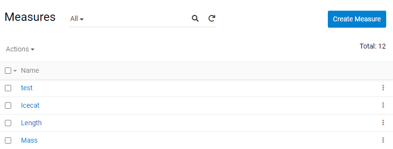
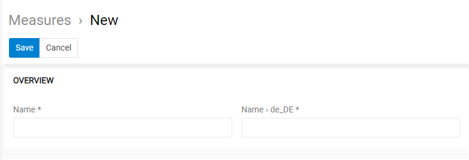
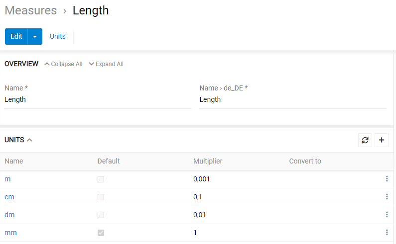
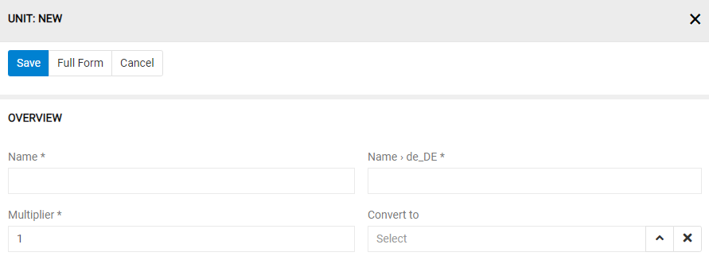
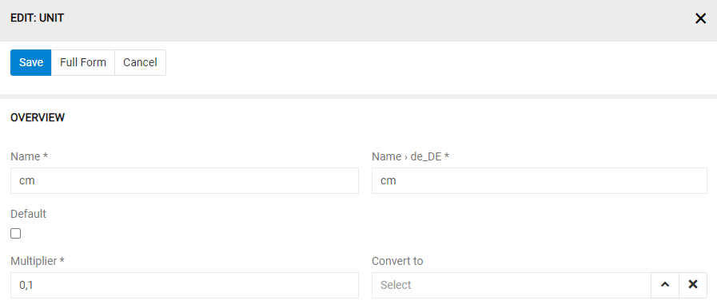
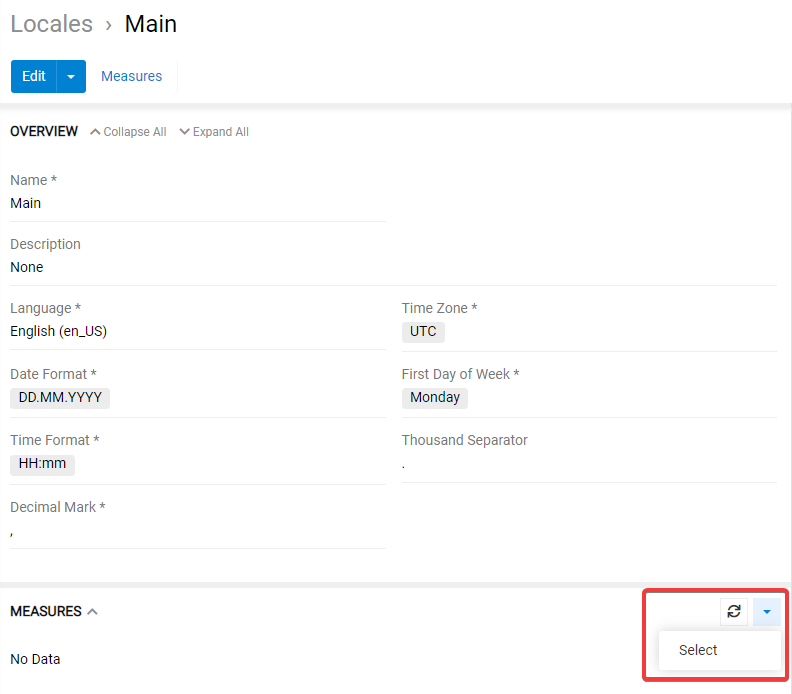
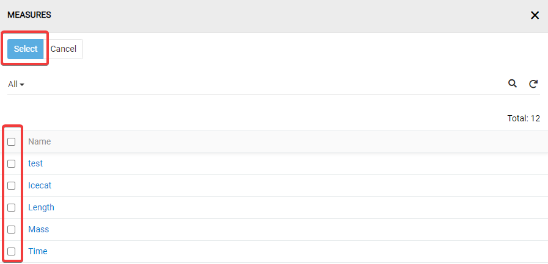
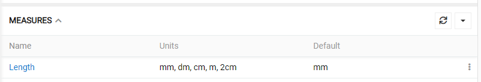
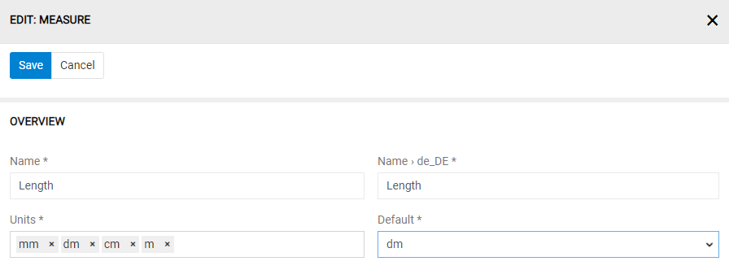

# Measure Unit Conversion
 
## Creating Measures and Units
 
AtroCore allows you to manage different Measures (e.g length or weight) and Measure Units (e.g. cm, mm, dm, m). It also supports the automatic measure unit conversion.
 
To manage this data go to `Administration > Measures`. Here you see the list of Measures, which are currently available on your system.
 

 
To create a new Measure, click on `Create Measure`. A popup window opens, here you can set the name of your new Measure and save the record.
 

 
> Measure is used for the fields and product attributes of the type "unit". You can define multiple Measures of a similar kind if you plan to use different Units for different attributes or fields. Thus, you may create the Measure "Length 1" with "mm" and "cm" as Units and the Measure "Length 2" with "mm", "m" and "km" as Units and assign each Measure to different fields or attributes.
 
After the Measure is created you can create and assign Units to it. These are visible in the "Units" panel.
 

 
To create a new Unit, click on the "+" icon in the top right corner of this panel.
 

 
Here you can
- define a name for the new Unit e.g. "mm" or "cm",
- set the "Multiplier", which is used for automatic unit conversion and
- choose the Unit to which the current Unit should automatically be converted.
 
If you create the very first Unit for some Measure, this Unit is automatically marked as "default", and its "Multiplier" is set to "1".
 
> If you want to store full unit names e.g. "meter" you need to add the field "description" to the Detail (small) Layout for Units and use this field for it. You can also create a new field for this via the "Entity Manager".
 
To edit a data record, use its menu. On the "Edit View" you can set a new Unit as a "default" Unit. In this case its "Multiplier" is set to 1, and all other "Multipliers" will be adjusted accordingly. The Unit marked as "default" cannot be deleted.
 

 
> The "Default" Unit is a base Unit on which all other Units for the current Measure are based. This is the only purpose of this setting.
 
## Localized Measure Units
In AtroCore you can create and use multiple Locales. For each Locale, you may decide whether you want to enable Measure Unit localization or not. This is done by adding a measure to the Locale and setting which units should be available for this measure. Click on the "Select" button to do this.
 

 
In the popup window select the measures for which you want to enable localized units and click on "Select".
 

 
After a Measure is added it will appear in the "Measures" panel for your Locale.
 

 
Per default all Units for the Measure are automatically added. To remove any of them open the appropriate data record for editing.
 

 
Here you leave only Units, which should be available for the current Locale. You must also choose a default Measure Unit for the Locale.
 
> Example: If you want some users to work only with "cm", "dm" and "mm" as Units for the Measure "Length" you need only enable these units for the Locale of this user.
 
## Automatic Unit Conversion
 
The "Multiplier" is used to automatically convert the values. It defines how many current Units match 1 default Unit.
 
> Example: You have "mm" set as the "default" Unit and its "Multiplier" is set to "1". You want to add "cm", its "Multiplier" should be set to 0,1 because 1 mm = 0,1 cm.
 
The values for the fields and attributes of the type "Unit" are always stored as shown.
 
The user always sees the value as it is stored, if this unit is available for his Locale (if no Locale is set for the system, the system assumes the user has the same Locale as the system). Otherwise, he sees the value in the Unit which is set as "Convert to" Unit for the stored Unit, provided this Unit is available for his Locale. If this Unit is not available the user sees the value in the Unit which is set as the "default" unit for this Measure for his Locale.
 
> Example: User A sees only kilometers (miles are set as "Convert to" for kilometers) and meters (default for his Locale), User B sees only miles (default for his Locale). User A saves the value "10 km". User B sees this value as "6.21371 miles". User B changes the value to 10 miles (the value "10 miles" is stored). User A sees this value as "16093,4 m".
 
## API
 
In addition, the API returns the values for all fields and attributes of the type "unit" in all Units of their Measure.