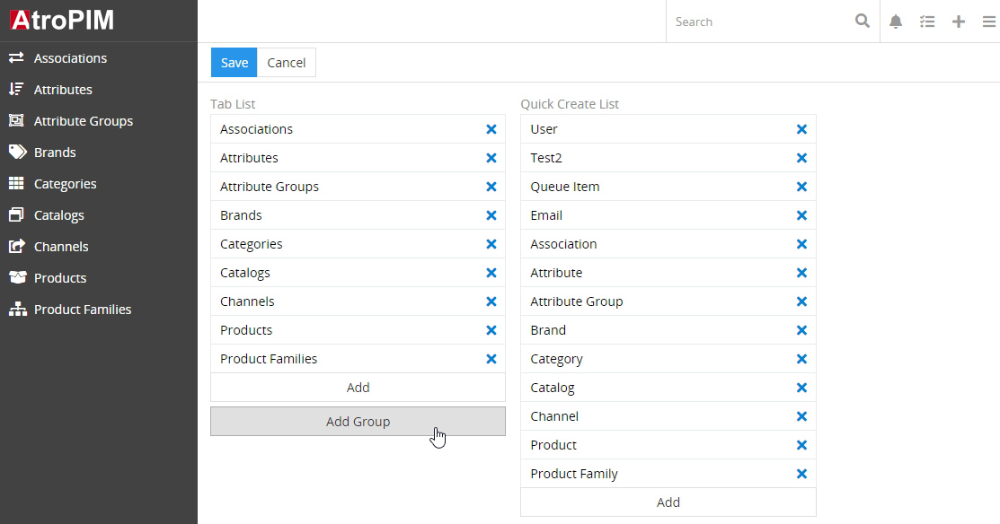
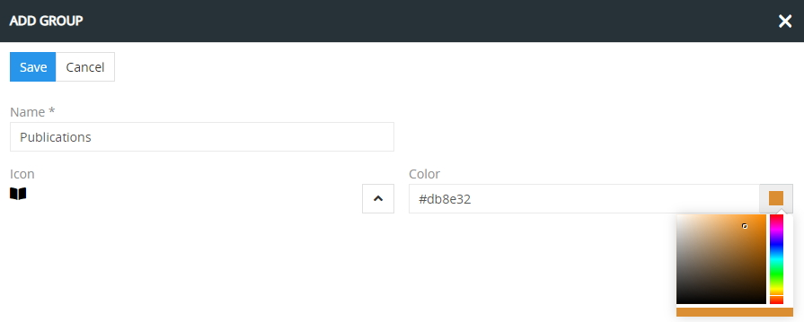
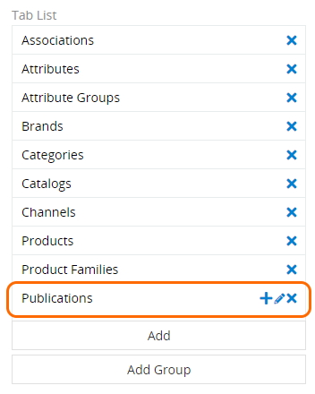
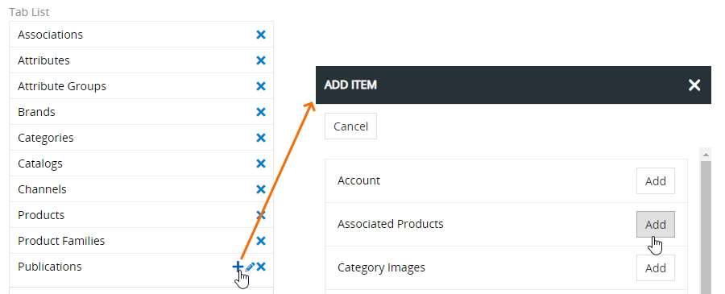
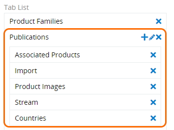
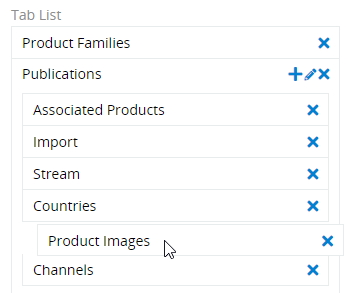
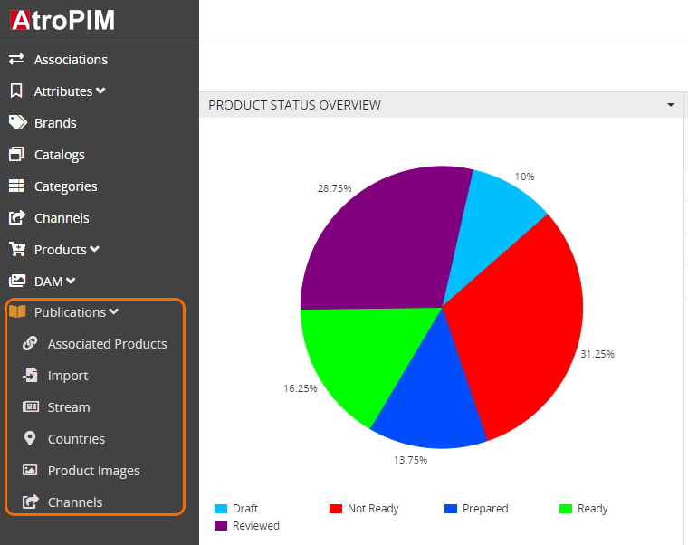
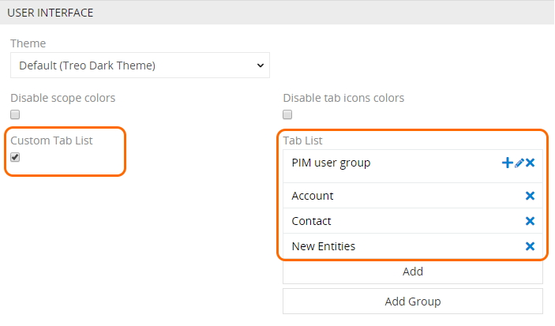

# Advanced Navigation

Das Modul "Advanced Navigation" ermöglicht die Erstellung von Navigationsgruppen, um die Benutzerfreundlichkeit Ihres AtroСore-, AtroPIM- oder AtroDAM-Systems zu verbessern. Dank des Moduls können Sie die zusammengehörende Navigationselemente zu **Gruppen** zusammenfassen, z.B. Exportfeeds und Exportaufträge können in "Export" gruppiert werden.

## Funktionen für den Administrator

Um das Navigationsmenü zu konfigurieren, gehen Sie auf `Administration> Benutzeroberfläche`.

Bitte beachten Sie, dass nach der Installation des Moduls  „Advanced Navigation“  der Tab `...`, welcher für die Ausblendung anderer Navigationspunkte genutzt wird, im Pop-up-Fenster  „Hinzufügen“  nicht mehr verfügbar ist. Im Modul „Advanced Navigation“ gehen wir davon aus, dass alle Navigationselemente gruppiert werden sollen. Der Tab `...` wird wieder verfügbar, wenn Sie das Modul aus AtroCore System deinstallieren.

### Navigationsgruppen

Um eine neue Navigationsgruppe zu erstellen, klicken Sie auf den Button `Gruppe hinzufügen`:

Geben Sie im angezeigten Pop-up-Fenster den Gruppennamen ein und weisen Sie bei Bedarf das Icon und die Farbe zu:

Klicken Sie auf `Speichern`, um die Erstellung der Gruppe abzuschließen und zur Seite „Benutzeroberfläche“ zurückzukehren. Die erstellte Gruppe wird zur Menüliste hinzugefügt:

Um die erstellte Gruppe zu bearbeiten, nutzen Sie den Stift-Button rechts neben der entsprechenden Gruppe in der Menüliste und nehmen Sie die gewünschten Änderungen im Bearbeitungs-Pop-up vor.

### Navigationspunkte

Navigationpunkte werden auch auf der Seite „Benutzeroberfläche“ verwaltet. Um zur Navigationsgruppe einen neuen Punkt (oder neue Punkte) einzufügen, klicken Sie auf den Button `+` rechts neben der entsprechenden Gruppe in der Menüliste und wählen Sie die gewünschten Punkte mittels des Buttons `Hinzufügen` im angezeigten Pop-up aus:

Schließen Sie das Pop-up-Fenster, um den Vorgang zu beenden. Die hinzugefügten Punkte werden in der entsprechenden Navigationsgruppe angezeigt:

Die Reihenfolge von gruppierten oder nicht gruppierten Navigationspunkten kann einfach per Drag-and-Drop konfiguriert werden:

*Bitte beachten Sie, dass ein bestimmter Menüpunkt in der Navigation nur einmal verwendet werden kann. Wenn Sie zu der Gruppe einen Punkt hinzufügen möchten, der bereits im Navigationsmenü ist, müssen Sie ihn zuerst mittels des Buttons `x` aus dem Menü löschen und dann mittels des Buttons `+` zur gewünschten Gruppe hinzufügen. Nicht gruppierte Punkte können nicht per Drag-and-Drop zur Gruppe hinzugefügt werden.* 

Um die Änderungen anzuwenden, klicken Sie auf der Seite „Benutzeroberfläche“ auf den Button `Speichern`. Aktualisieren Sie die Seite, um das erneute 2-Ebenen-Navigationsmenü anzusehen:

Bitte beachten Sie, dass eine leere Navigationsgruppe (d.h. ohne Navigationspunkte) im Navigationsmenü nicht angezeigt wird. 

## Funktionen für den Nutzer

Wenn das Modul „Advanced Navigation“ vom Administrator im AtroCore-System installiert und konfiguriert wurde, sehen die Nutzer eine 2-Ebenen-Navigation an. Klicken Sie auf den Gruppennamen, um die zu dieser Gruppe gehörenden Navigationspunkte aufzuklappen oder zusammenzuklappen.

Jeder Nutzer kann sein eigenes Navigationsmenü konfigurieren. Dafür muss man die Checkbox `Custom tab list` auf der Seite „Einstellungen“  im Panel „Benutzeroberfläche“ aktivieren. Erstellen Sie die gewünschte Navigationsgruppe und fügen Sie ihr die Punkte auf die gleiche Weise hinzu, wie es für den [Administrator](#navigation-groups) beschrieben ist.

Nach den Updates und Upgrades von AtroCore sollten alle vorgenommenen Einstellungen erhalten bleiben. Wenn sie verschwinden, sollte das  „Advanced Navigation“-Modul erneut installiert werden – die verschwundenen Einstellungen werden wiederhergestellt, da das Modul sie in einer separaten Datei speichert.