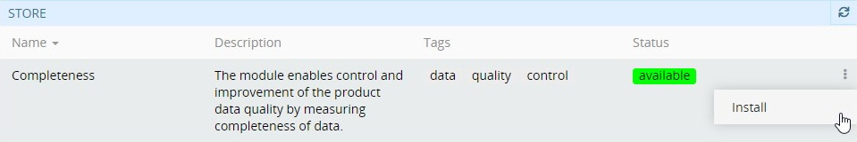

# Completeness

Das Modul  „Completeness“  misst in Prozent den Ausfüllgrad von Pflichtfeldern, was erlaubt, die Qualität der Daten von Entitätseinträgen zu kontrollieren und zu verbessern. Zudem ermöglicht das Modul, die Entitätseinträge zu speichern, bei denen die Pflichtfelder leer geblieben sind. Bitte beachten Sie, dass, falls das Modul  „Completeness“  in Ihrem System nicht installiert und aktiviert ist, es nicht möglich ist, die Einträge zu speichern, bei denen nicht alle Pflichtfelder ausgefüllt sind. 

Dank der [graphischen Darstellung](#completeness-dashlets) haben Sie die volle Kontrolle über die Vollständigkeit der Daten Ihrer Entitätseinträge im System.

## Installation 

Um das Modul  „Completeness“   in Ihrem System zu installieren, gehen Sie auf `Administration > Modulmanager`; suchen Sie dieses Modul in der Liste „Shop“  und klicken Sie auf `Installieren`:

Wählen Sie im angezeigten Installations-Pop-up die gewünschte Version aus und klicken Sie auf den Button `Installieren`. Der Modulhintergrund wird grün und das Modul wird in den Bereich „Installiert“ des Modulmanagers verschoben. Klicken Sie `das Update starten`, um die Installation zu bestätigen.

Bitte beachten Sie, dass nach dem Systemupdate alle Nutzer abgemeldet werden. 

Um das Modul  „Completeness“ zu aktualisieren / zu entfernen, nutzen Sie die entsprechenden Optionen aus dem Menü für einzelne Datensatzaktionen in `Administration > Modulmanager`.

## Funktionen für den Administrator

Das Modul  „Completeness“ wurde in erster Linie für die Verwendung mit dem [AtroPIM](https://atropim.com/de/hilfe/what-is-atropim)-System erstellt, deshalb ist die weitergehende Beschreibung des Moduls im Kontext von AtroPIM angeführt.

### Aktivierung des Moduls 

Um den Mechanismus Completeness für eine bestimmte Entität zu aktivieren, gehen Sie auf `Administration > Entitätsmanager`, wählen die nötige Entität (z.B. Product) aus und klicken auf `Bearbeiten`: 

Im angezeigten Bearbeitungs-Pop-up setzen Sie die Checkbox  „Ausfüllen“ und klicken Sie auf den Button `Speichern`, um die Änderungen anzuwenden:

Bitte beachten Sie, dass der Mechanismus Completeness für so viele Entitäten wie benötigt auf die gleiche Weise aktiviert werden kann.

### Die Felder als Pflichtfelder markieren 

Das Konzept der Vollständigkeit gilt nur für die Pflichtfelder. Um ein Feld als Pflichtfeld zu markieren, gehen Sie auf `Administration > Entitätsmanager`, klicken auf `Felder` bei der nötigen Entität: 

Im angezeigten Fenster werden alle Felder der ausgewählten Entität angezeigt. Wählen Sie das nötige Feld aus oder erstellen Sie ein neues, das ausgefüllt werden muss, und setzen Sie die Checkbox `Erforderlich`.  

Auf diese Weise können Sie beliebig viele Entitätsfelder als Pflichtfelder markieren. Infolgedessen werden die angegebenen Felder in die Vollständigkeitsberechnung einbezogen.

### Die Attribute als Pflichtattribute markieren

Für die Entität `Produkt` wird die Vollständigkeit nicht nur aufgrund der Pflichtfelder berechnet, sondern auch aufgrund der Pflichtattribute. Sie können auch die *Produktattribute* (sowohl von `Global` und `Channel` Scope) als Pflichtattribute definieren. Dies kann auf der Seite der Detailansicht von Produktfamilie durchgeführt werden.

Die Zuordnung von `kanalspezifischen` Attributen zu Produkten ermöglicht die Berechnung der *kanalspezifischen Vollständigkeit* zusätzlich zu der gesamten Vollständigkeit. Wenn es jedoch keine Pflichtattribute gibt, die dem angegebenen Kanal zugeordnet sind, wird die Vollständigkeit aufgrund der `globalen` Pflichtattributwerte berechnet. 

Weitere Informationen zu den [Attributen](https://atropim.com/de/hilfe/attributes), [Kanälen](https://atropim.com/de/hilfe/channels) und [Produktfamilien](https://atropim.com/de/hilfe/product-families) finden Sie im **AtroPIM User Guide**.

### Konfiguration der Vollständigkeitswert-Anzeige 

Um die Anzeige des Ausfüllgrades für die vorher konfigurierte Entität hinzuzufügen, gehen Sie auf `Administration > Layout Manager` und klicken Sie auf die bestimmte Entität in der Liste, um die Liste der Layouts auszuklappen, die für diese Entität verfügbar sind. Klicken Sie auf das Layout, das Sie konfigurieren möchten  (z.B. `Liste`) und aktivieren Sie das Feld `Complete` durch drag-and-drop von der rechten Spalte in die linke:    

Klicken Sie auf den Button `Speichern`, um den Vorgang abzuschließen. Das hinzugefügte Feld `Complete` wird im konfigurierten Layouttyp für die gegebene Entität angezeigt:

Bei der Bearbeitung des Entitätseintrags mit der aktivierten Vollständigkeit (z.B. beim Hinzufügen, Entfernen usw. des Pflichtfeldes) wird der Prozentwert der Vollständigkeit sofort neu berechnet.

#### Suchfilter

Auf die gleiche Weise kann man auch die Vollständigkeitsstufen zur Suchfilterliste im Layout-Manager hinzufügen:

Infolgedessen werden die aktivierten Filter in die Filter-Dropdown-Liste der konfigurierten Entität eingebunden:

## Prinzipien der Vollständigkeitsberechnung

Mit dem Modul "Completeness" wird die Datenberechnung den folgenden Verfahren entsprechend durchgeführt:

- **Totale Vollständigkeit **- der Vollständigkeitsgrad von Pflichtfeldern, einschließlich ihrer Locales. Bei Produktdatensätzen umfasst die Berechnung der totalen Vollständigkeit auch die Pflichtattribute und deren Locales.
- **Lokale Vollständigkeit** - der Vollständigkeitsgrad von mehrsprachigen Pflichtfeldern. Bei Produktdatensätzen sind mehrsprachige `globale` Pflichtattribute (der Typen `Boolean`, `Enum`, `MultiEnum`, `Text`, `Varchar` und `Wysiwyg` mit gesetzter Checkbox `Multi-Language`) auch in dieser Berechnung einbezogen. 
- **Vollständigkeit** - der Vollständigkeitsgrad von Pflichtfeldern und Pflichtattributen. Die mehrsprachigen lokalen Pflichtffelder sind hier nicht enthalten, nur die Werte von Hauptfeldern. 

Bei Produktdatensätzen gibt es zwei zusätzliche Vollständigkeitstypen: 

- **Globale Vollständigkeit** - der Vollständigkeitsgrad von Pflichtfeldern, einschließlich ihrer Locales. Bei Produktdatensätzen enthält die totale globale Berechnung auch die globalen Pflichtattribute und deren Locales.

- **`Kanalspezifische` Vollständigkeit** - der Vollständigkeitsgrad von Pflichtfeldern und Pflicht-`Kanal`attributen. Wenn die Pflicht-`Kanal`attributwerte nicht verfügbar sind, wird die Vollständigkeit nur anhand der Pflichtfelder berechnet.

## Funktionen für den Nutzer 

Nachdem das Modul  „Completeness“ vom Administrator installiert und konfiguriert wurde, kann der Nutzer den vom Administrator vordefinierten Ausfüllgrad der Entitätseinträge ansehen und die Einträge in dieser Spalte entsprechend sortieren:

Außerdem kann man die Entitätsdatensätze nach ihrem Vollständigkeitsgrad gemäß den vom Administrator vordefinierten [Suchfiltern](https://atropim.com/store/completeness#search-filters) filtern:

Der Nutzer kann auch die Vollständigkeitsstatistik beeinflussen, indem er die Pflichtfelder und Attribute der konfigurierten Entitäten gemäß seinen Zugangsrechten bearbeitet.

### Logik der Vollständigkeitsberechnung  

AtroPIM unterstützt drei Typen der Berechnung von Vollständigkeit der Entitätsdaten in Prozent:

- **Overall** – Ausfüllgrad der Pflichtfelder und `globalen` Pflichtattribute; 
- **Channel** – Ausfüllgrad der Pflichtfelder und `kanalspezifischen` Pflichtattribute. Wenn `kanalspezifische` Pflichtattribute nicht verfügbar sind,  wird die Vollständigkeit mithilfe der `globalen` Pflichtattributwerte berechnet.  
- **Locale** – Ausfüllgrad der mehrsprachigen Pflichtfelder und mehrsprachigen `globalen` Pflichtattribute (`Array MultiLang`, `Enum MultiLang`, `Multi-Enum MultiLang`, `Text MultiLang`, `Varchar MultiLang`, und `Wysiwyg MultiLang`). 

### Vollständigkeit-Dashlets  

Um die Vollständigkeit der Ausfüllung von Produktinformationen bequem zu verfolgen, kann der Nutzer spezielle Dashlets auf seinem benutzerdefinierten Dashboard anzeigen lassen:

Die folgenden Dashlets können angezeigt werden: 
- **Vollständigkeitsübersicht** –  Werte der gesamten Vollständigkeit, einschließlich konfigurierter Locales und Kanäle, in der Tabellenansicht.  
- **Vollständigkeit der Locale** – Vollständigkeit nach Locales getrennt und insgesamt, in grafischer Form.
- **Vollständigkeit der Kanäle** – Vollständigkeit nach Kanälen getrennt und insgesamt, in grafischer Form. 

Weitere Informationen zu Dashboards und Dashlets finden Sie im entsprechenden [Artikel](https://atropim.com/de/hilfe/user-interface) im AtroPIM User Guide.

## Kaufbedingungen

Der Preis gilt zzgl. MwSt. Für den oben angegebenen Preis erhalten Sie das Modul einschließlich Updates und Upgrades für den Zeitraum eines Jahres. Nach dieser Zeit können Sie Ihre letzte Version des Moduls weiter verwenden oder das Modul mit einem Rabatt von 50% erneut erwerben, um das Recht zu bekommen, die Updates und Upgrades für ein weiteres Jahr zu erhalten. Im Übrigen gilt unser [ELV](https://atropim.com/de/elv) (Endbenutzerlizenzvertrag). 

## Anpassung
Das Modul kann an Ihre Bedürfnisse angepasst werden – zusätzliche Funktionen können hinzu programmiert werden, vorhandene Funktionen können geändert werden. Bitte kontaktieren Sie uns diesbezüglich. Es gelten unsere [AGB](https://atropim.com/de/agb) (Allgemeine Geschäftsbedingungen).

## Demo
Bitte kontaktieren Sie uns und wir senden Ihnen die Zugangsdaten für die Demoversion.

