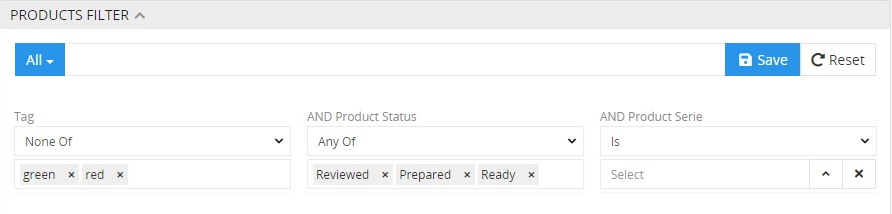
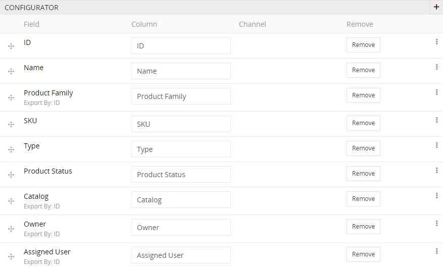
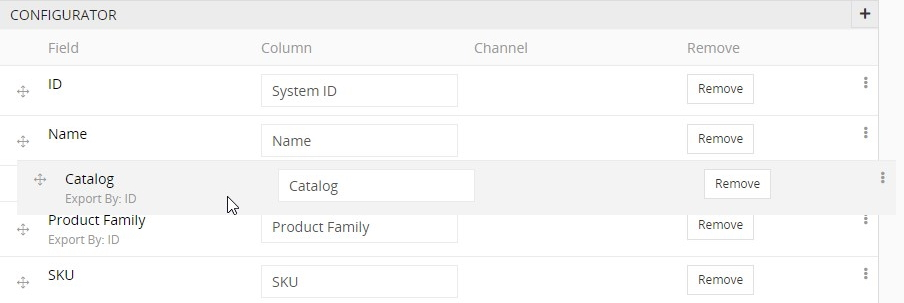
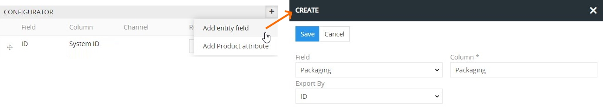
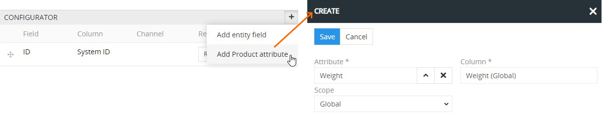
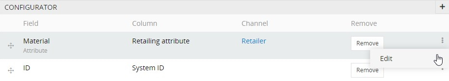
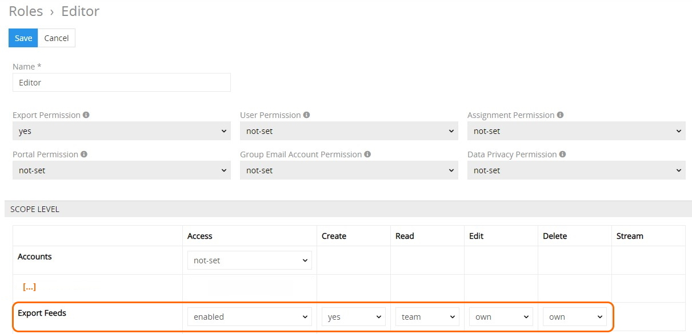
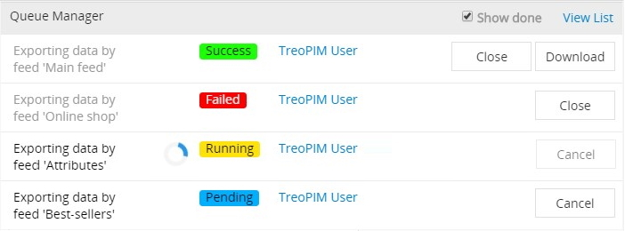

Das Modul „Export Feeds“ ermöglicht die benutzerfreundliche Anwendung von Export Feeds. Im Allgemeinen ist Export Feeds eine Vorlage für den Datenexport, die von den Nutzeranforderungen und den aus AtroPIM zu exportierenden Entitätsdaten abhängt. Erfahren Sie [hier](https://atropim.com/help/what-is-atropim) mehr über das AtroPIM-System und seine Vorteile.

Mit Hilfe des Moduls „Export Feeds“ wird der Datenexport aus dem AtroPIM-System gemäß den Exportvorlagen durchgeführt, die weiter konfiguriert, angepasst und in verschiedenen Zeitintervallen wiederverwendet werden können. Export Feeds können auch dazu genutzt werden, um den Prozess des Datenexports via Scheduled Jobs zu automatisieren.

## Installation

Um das Modul „Export Feeds“ in Ihrem System zu installieren, gehen Sie zur `Administration> Modulmanager`. Finden Sie dieses Modul in der Liste „Shop“ und klicken Sie auf `Installieren`:

Wählen Sie im angezeigten Installations-Pop-up die gewünschte Version aus und klicken Sie auf den Button `Installieren`. Der Modulhintergrund wird grün und das Modul wird in den Modulmanager-Bereich „Installiert“ verschoben. Klicken Sie auf `Update starten`, um die Installation zu bestätigen.

*Bitte beachten Sie, dass nach dem Systemupdate alle Nutzer abgemeldet werden.*

Um das Modul „Export Feeds“ zu aktualisieren / zu entfernen, nutzen Sie entsprechende Optionen aus der Drop-down-Liste für einzelne Datensatzaktionen im `Administration > Modulmanager`.

## Funktionen für den Administrator

Das Modul „Export Feeds“ erweitert die Funktionalität des [AtroPIM](https://atropim.com/help/what-is-atropim)-Systems erheblich, so ist eine weitere Modulbeschreibung im Kontext von AtroPIM gegeben.

Nach der Modulinstallation wird eine neue `Export- Feeds`-Konfigurationsgruppe zum AtroPIM-Adminbereich hinzugefügt. Es ist auch möglich, Export Feeds als separaten Navigationsmenüpunkt auf der Seite `Administration> Benutzeroberfläche` hinzuzufügen:

Das Modul „Export Feeds“ unterstützt auch die Übertragung von Export- Feeds-Daten verschiedener Kanäle. Um die Anzeige der Export Feeds zu aktivieren, die mit separaten [Kanälen](#channel-export-via-export-feeds) verknüpft sind, muss man ein entsprechendes Bottom Panel im Layout-Manager via Drag-and-Drop hinzufügen:

### Erstellung von Export Feeds

Um einen neuen Export Feed zu erstellen, gehen Sie zur `Administration> Export Feeds` oder klicken Sie im Navigationsmenü auf `Export Feeds` und dann auf den Button `Export Feed erstellen`. Es wird ein Pop-up für die allgemeine Erstellung angezeigt:

Geben Sie hier den Namen des Export Feeds ein, wählen Sie dessen Typ aus und geben Sie dessen Eigentümer an. Aktuell werden die folgenden Export-Feed-Typen unterstützt:

- **Simple** – für den Export der Daten aus beliebiger Entität Ihres Systems mit der Möglichkeit, die Liste der zu exportierenden Felder, ihre Reihenfolge und Namen zu konfigurieren. Mit diesem Export-Feed-Typ können Sie auch Produktattributwerte und Produktkategorien für die Produktentitäten gemäß ihren Umfängen exportieren. Weitere Informationen zu den [Attributen](https://atropim.com/help/attributes) und [Produkten](https://atropim.com/help/products) finden Sie im **AtroPIM User Guide**.
- **Produktbild** – für den Export der in Ihrem System vorhandenen Produktbilder. Die resultierende Datei enthält die URL-Links zu exportierten Produktbildern, die gemäß dem im System eingestellten Umfang für Produktbilder (global oder channel) angeordnet sind.

Klicken Sie auf den Button `Speichern`, um den Vorgang abzuschließen. Der neue Datensatz wird zu der Export-Feeds-Liste hinzugefügt. Sie können ihn sofort auf der Detailansichtsseite konfigurieren oder später darauf zurückkommen.

### Konfiguration von Export Feeds

Um das Export Feed zu konfigurieren, klicken Sie auf den gewünschten Datensatz in der Liste von Export Feeds. Die folgende Detailansichtsseite wird geöffnet:

Inline-Bearbeitung wird hier unterstützt. Bevor Sie Änderungen vornehmen, müssen Sie auf das Stiftsymbol rechts neben jedem bearbeitbaren Feld klicken.

*Ausführliche Informationen zur Inline-Bearbeitung und zu anderen Funktionen des AtroPIM-Systems finden Sie im Abschnitt **Entity Records** des Artikels [**Views and Panels**](https://atropim.com/help/views-and-panels) in unserem User Guide.*

Folgende Einstellungen sind im Panel `OVERVIEW` verfügbar:

- **Aktiv** – Aktivieren Sie dieses Kontrollkästchen, um den Export Feed zu aktivieren. Wenn der Export Feed nicht aktiviert ist, wird die Exportfunktion für diesen deaktiviert.
- **Name** – Ändern Sie bei Bedarf den Namen des Export Feeds.
- **Kanal** – Um die für einen bestimmten Kanal vorbereiteten Daten zu exportieren, stellen Sie den gewünschten Kanal ein, indem Sie auf den Button „Aktionen“ klicken und den vorhandenen Kanal im angezeigten Pop-up-Fenster „Kanäle“ auswählen. Diese Einstellung ist nur für Produkte verfügbar.
- **Beschreibung** – Geben Sie die Beschreibung der Verwendung vom Export Feed ein, d.h. welche Daten und in welcher Form exportiert werden. Dieses Feld ist nicht erforderlich.
- **Typ** – Der Export-Feed-Typ, der nur bei der Erstellung definiert wurde. Er kann nicht geändert werden.

#### Datei

Die Parameter der Exportdatei werden im Panel `FILE` konfiguriert: 

  

- **File Format** – wählen Sie aus der Drop-down-Liste den Dateityp - CSV oder XLSX (Excel) - aus, in dem der Datenexport ausgeführt werden soll.  
- **Header Zeile** – lassen Sie die Checkbox aktiviert, um die Spaltennamen in die Exportdatei aufzunehmen oder entfernen Sie deren Auswahl, um die Spaltennamen aus dem Export auszuschließen.

Wenn das CSV-Dateiformat ausgewählt ist, werden folgende Einstellungen hinzugefügt, die über die Drop-down-Listen zu konfigurieren sind:
- **Feld-Trennzeichen** – wählen Sie das bevorzugte Feld-Trennzeichen aus, das in der Exportdatei verwendet werden soll:  `;`, `,`, `\t`, `|`.

- **Text-Anführungszeichen** – wählen Sie das bevorzugte Trennzeichen der Werte in einer Zelle aus: einfache oder Doppel-Anführungszeichen. 

Beachten Sie bitte, dass das XLSX (Excel)-Dateiformat standardmäßig eingestellt ist und die `Header Zeile`-Checkbox aktiviert ist.

#### Filter der Produkte

Das AtroPIM-System ermöglicht es, einen bestimmten Bereich von Produktdaten zu exportieren, der im Panel `Filter der Produkte` definiert werden kann. Hier können Sie Filter nach Kategorien erstellen, die mit dem Produkt verknüpft sind, nach Entitätsfeldern des Produkts selbst sowie nach Produktattributen und deren Werten:

  

Sie können die erstellten Filter für die weitere Nutzung für den Export der Produktdaten speichern. 

Diese Einstellung ist nur für Produkte verfügbar. 

Die Filtereinstellungen für Export Feeds sind die gleichen wie für die Produktlistenansicht. Die Liste der Filter kann aber auch im Layout-Manager im Layout `Suchfilter` für die Entität `Produkte` geändert werden:

  

#### Einfache Typ-Einstellungen

Um die Bearbeitung der Parameter im Panel `EINFACHE TYP-EINSTELLUNGEN` zu ermöglichen, klicken Sie auf den `Bearbeiten`-Button auf der Seite der Detailansicht des aktuellen `einfachen` Export Feeds und konfigurieren Sie folgende Einstellungen:
  

- **Entität** – wählen Sie aus der Drop-down-Liste der im System verfügbaren Entitäten den gewünschten Entitätstyp aus, für den dieser Export Feed verwendet werden soll.
- **Feldwert Begrenzer** – geben Sie das bevorzugte Trennzeichen der Werte im Feld ein.

#### Konfigurator

Die Konfiguration der Entitätsfelder wird im Panel `KONFIGURATOR` durchgeführt. Standardmäßig werden dort die Pflichtfelder des Entitätstyps angezeigt, der im Panel `EINFACHE TYP-ENEINSTELLUNGEN` definiert ist. Abhängig von dieser Auswahl enthält das Panel `KONFIGURATOR` verschiedene Felder. Für Produkte sieht dieses Panel wie folgt aus:

Hier können Sie den Namen des Entitätsfeldes ändern, der in der Exportdatei angezeigt werden soll. Dafür geben Sie den gewünschten Wert ins entsprechende Textfeld `Spalte` ein:

Die Reihenfolge, in der die Felder in der Exportdatei angezeigt werden sollen, kann man auch hier mit Hilfe von drag-and-drop ändern: 

Nutzen Sie den Button `Löschen`, um das gewünschte Feld aus der Exportdatei zu entfernen.

Um mehr Entitätsfelder für den Export hinzuzufügen, wählen Sie die Option `Entitätsfeld hinzufügen` aus dem Drop-down-Menü. Das folgende Pop-up wird angezeigt:

Wählen Sie hier das Feld aus der Drop-down-Liste aller Felder aus, die im System für die angegebene Entität verfügbar sind, ändern Sie bei Bedarf den Wert `Spalte` und definieren, ob der Datenexport nach ID oder Code erfolgen soll (für die Felder, wo diese Option verfügbar ist).

Für das Feld `Product categories` gibt es auch die Möglichkeit, eine Umfangsebene auszuwählen:

Wenn die `Channel`-Umfangsebene definiert ist, sollten Sie auch im entsprechenden Feld den benötigten Kanal auswählen, der für die Produktkategorien verwendet werden soll. 

Das Modul „Export Feeds“ ermöglicht es auch, Produktattributwerte zu exportieren. Sie können zum Export Feed im `KONFIGURATOR`-Panel mit Hilfe der Option `Produktattribut hinzufügen` aus dem Drop-down-Menü hinzugefügt werden:

Wählen Sie im angezeigten Erstellungs-Pop-up das Attribut aus der Liste der vorhandenen Attribute aus und definieren Sie dessen Umfangsebene - global oder channel. Das Feld `Spalte` wird abhängig von den ausgewählten Optionen automatisch ausgefüllt:

Alternativ können Sie einen anderen `Spaltennamen` über die Tastatur eingeben.

Sowohl Entitätsfelder als auch Produktattribute, die zum Export Feed hinzugefügt wurden, können über die entsprechende Option im Menü für einzelne Datensatzaktionen bearbeitet werden:

### Zugangsrechte

Um die Erstellung, Bearbeitung, Nutzung und Entfernung der Export Feeds für andere Nutzer zu ermöglichen, konfigurieren Sie die entsprechenden Zugangsrechte zur `Export-Feeds`-Entität für die gewünschte Benutzer- / Team- / Portalbenutzerrolle auf der Seite `Administration > Rollen > 'Rollenname'`:

Um die Verwendung von Export Feeds aus Kanälen zu ermöglichen, konfigurieren Sie mindestens Leserechte für die Entität `Kanäle` auf derselben Seite.

## Funktionen für den Nutzer

Nachdem das Modul „Export Feeds“ vom Administrator installiert und konfiguriert wurde, kann der Nutzer mit Export Feeds entsprechend seiner Rollenrechte arbeiten, die vom Administrator vordefiniert wurden.

Um den Export der Daten über den aktiven Export Feed zu starten, klicken Sie auf den Button `Export now` auf seiner Detailansichtsseite  oder verwenden Sie die Option `Export now` im Menü für einzelne Datensatzaktionen auf der Seite der Listenansicht von `Export Feeds`:

Wenn der Export gestartet ist, werden sein Verlauf und aktueller Status im Pop-up des Queue Managers angezeigt, das automatisch erscheint:

Nach dem erfolgreichen Datenexport können Sie die exportierte Datei direkt aus dem Queue Manager herunterladen oder die erledigte Exportaufgabe schließen.

### Kanalexport über Export Feeds

Wenn der aktive Kanal einen oder mehrere mit ihm verknüpfte Export Feeds enthält, ist die Funktion des Kanalexports für diesen Kanal aktiviert. Um Daten zu exportieren, die zu einem separaten Kanal gehören, öffnen Sie den nötigen Kanal und klicken Sie auf den Button `Export now`:

Um die Liste der mit dem Kanal verknüpften Export Feeds in einem separaten Panel anzusehen und zu bearbeiten, muss der Panel `Export Feeds` vom [Administrator](#funktionen-für-den-administrator) auf die oben beschriebene Weise hinzugefügt werden.

Bei der Verwendung des Kanalexports werden die Daten in ein einzelnes Archiv mit separaten Dateien für jeden aktiven Export Feed exportiert, der mit dem angegebenen Kanal verknüpft ist.

## Anpassung
Das Modul kann an Ihre Bedürfnisse angepasst werden – zusätzliche Funktionen können hinzu programmiert werden, vorhandene Funktionen können geändert werden. Bitte kontaktieren Sie uns diesbezüglich. Es gelten unsere AGB (Allgemeine Geschäftsbedingungen).

## Demo
https://demo.atropim.com/

## Lizenz
Dieses Modul wird unter der GNU GPLv3 [Lizenz](https://www.gnu.org/licenses/gpl-3.0.en.html) veröffentlicht.

