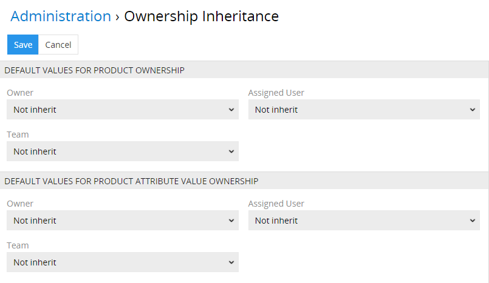
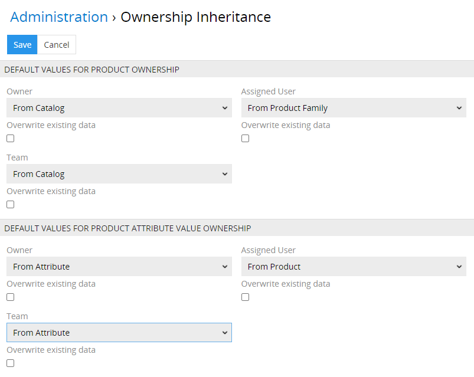

# Ownership Inheritance

Das Modul ermöglicht, die Vererbung der Besitzerinformationen für die ausgewählten Entitäten zu konfigurieren. Diese Funktionalität ist vor allem für größere Anwender interessant, die die Berechtigungen für einzelne Entitäten flexibler gestalten möchten.

Die Besitzerinformationen, wie zugewiesener Benutzer, Besitzer, zugewiesene Teams sind für die Bestimmung der Berechtigungen und Zugangsebenen im System von Bedeutung. Diese können für jede Entität aktiviert oder deaktiviert werden.

Dank dieses Moduls ist es möglich zu konfigurieren, dass gewisse Datensätze die Besitzerinformationen von den übergeordneten Entitäten im System erben. Dies ermöglicht Ihnen, Zeit für die Eingabe der Besitzerinformationen zu sparen und die notwendigen Berechtigungen trotzdem vergeben.

## Administrator Funktionen
Aktuell kann der Administrator die Vererbungsregeln für die Entitäten Produkte und Produktattributwerte einrichten.

### Vererbung der Besitzerinformationen für ein Produkt

Der zugewiesene Besitzer eines Produktes kann vererbt werden:
- vom Produktkatalog
- von der Produktfamilie

Der Besitzer eines Produktes kann vererbt werden:
- vom Produktkatalog
- von der Produktfamilie

Die zugewiesenen Teams eines Produktes können vererbt werden:
- vom Produktkatalog
- von derProduktfamilie

### Vererbung der Besitzerinformationen für einen Produktattributwert

Der zugewiesene Besitzer eines Produktattributwertes kann vererbt werden:
- vom Produkt
- vom Attribut

Der Besitzer eines eines Produktattributwertes kann vererbt werden:
- vom Produkt
- vom Attribut

Die zugewiesenen Teams eines Produktattributwertes können vererbt werden:
- vom Produkt
- vom Attribut

Es besteht auch die Möglichkeit, die bestehenden Besitzerinformationen zu überschreiben, indem die vorkonfigurierten Vererbungen auf alle vorhandenen Datensätze angewendet werden. Dafür sollte man den jeweiligen Checkbox “Overwrite existing data” anklicken.

## Benutzerfunktionen
Von den Benutzern werden keine zusätzlichen Aktionen verlangt.

Wird ein Produkt oder ein Produktattributwert erstellt, soll man für diese den Besitzer, den zugewiesenen Benutzer und die zugewiesenen Teams nicht mehr selbst eintragen, denn diese Werte werden automatisch laut den vorkonfigurierten Vererbungsregeln befüllt.

### Beispiel 1:
Es ist konfiguriert, dass der Besitzer eines Produktes von der Produktfamilie zu vererben ist. Wird dieser Besitzer bei der Produktfamilie des Produktes geändert, wird der Besitzer bei dem betroffenen Produkt auch automatisch geändert.

### Beispiel2:
Wird für die Produktattributwerte die Vererbung des Besitzers vom Produkt eingerichtet, bekommt jeder dem Produkt zugeordneter Produktattributwert automatisch denselben Besitzer wie das Produkt selbst. Somit kann erreicht werden, dass wenn ein Benutzer den Zugang zu einem Produktdatensatz hat, er auch automatisch den Zugang zu allen dessen Attributwerten bekommt.

Die Vererbung kann ausgeschaltet werden. Dafür sollte man auf das Kette-Icon klicken. Ist die Vererbung ausgeschaltet, kann man die Besitzerinformationen manuell vorgeben. Damit die Änderungen bei den übergeordneten Datensätzen zu automatischen Änderungen der Besitzerinformationen bei den Produkten oder Produktattributwerten führen, sollte man die Vererbung der Besitzerinformationen wieder einschalten.
