# Completeness

The "Completeness" module measures in percentage the completeness level of the required fields that allows you to control and improve the entity records data quality. In addition, it enables saving entity records, in which required fields are left empty. Please, consider that without the "Completeness" module installed and activated in your system, saving records without filling in all the required fields is not possible.

Thanks to the [graphical representation](#completeness-dashlets), you have full control over the completeness of your entity records data in the system.

## Administrator Functions

The "Completeness" module was created primarily to be used together with the AtroPIM system, so further description of the module is given in the context of AtroPIM.

### Module Activation 

To activate the completeness mechanism for a certain entity, go to `Administration > Entity Manager`, select the desired entity (e.g. Product) and click `Edit`:

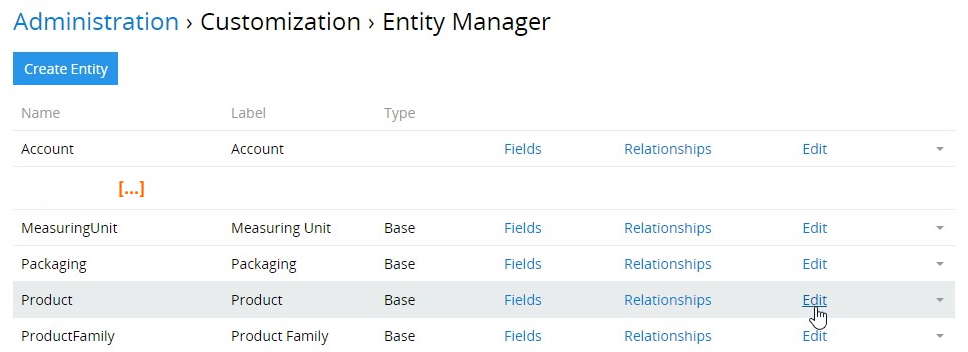

In the editing pop-up that opens, select the `Completeness` checkbox and click the `Save` button to apply the changes:

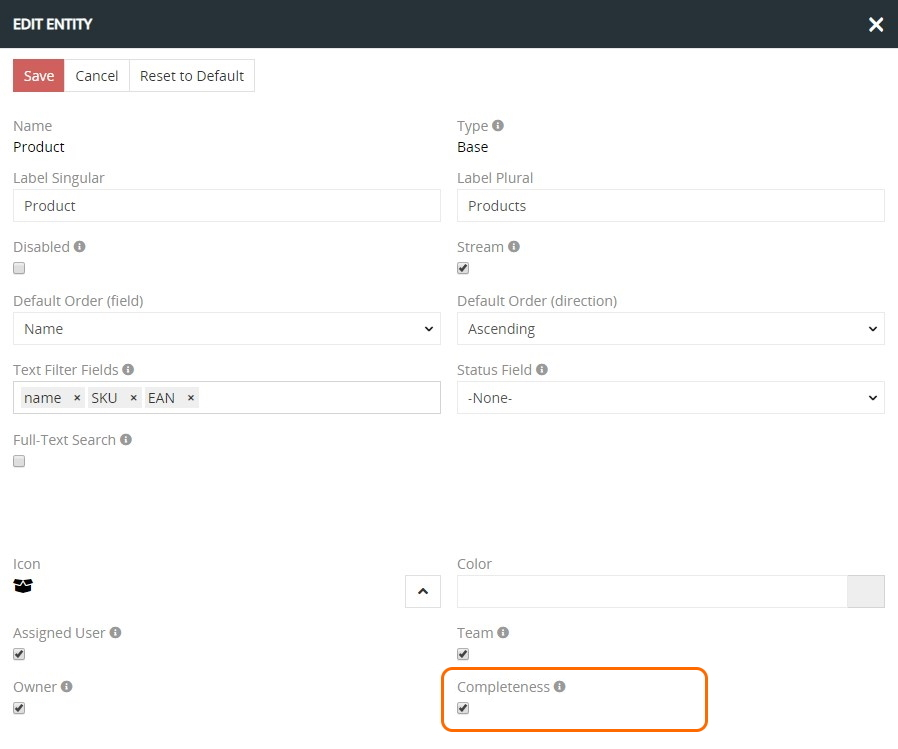

Please, note that in the same way you can activate the completeness mechanism for as many entities as needed.

### Marking Entity Fields as Required

The concept of completeness is applied only to the required fields. To mark the *field* as required, go to `Administration > Entity Manager` and click `Fields` for the desired entity:

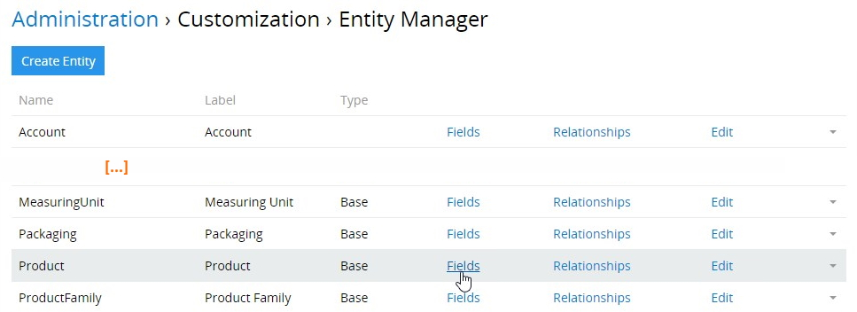

In the new window that opens, all fields of the selected entity are displayed. Open the desired existing field or create a new one that must be completed and select the `Required` checkbox:

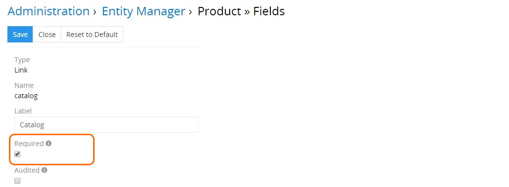

In such a way, you can mark as required as many entity fields as you need. As a result, the given field(s) will be included to the completeness calculation.

### Marking Product Attributes as Required 

For the `Product` entity, completeness is calculated not only on the basis of the required fields, but also on the basis of the required attributes. You can define product *attributes* as required, both of the `Global` and `Channel` scope. This is performed on the [Product Family](../atropim/user-guide/product-families.md) detail view page:

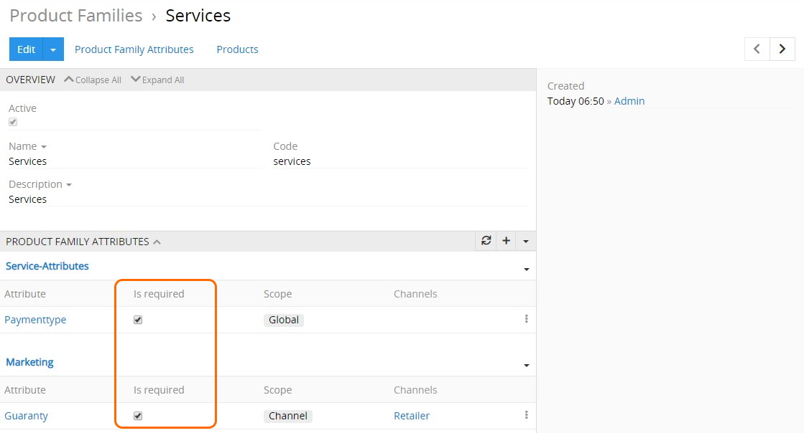

Linking `Channel` attributes to the product records allows you to have *channel completeness* [calculated](#completeness-calculation-logic) separately for each channel linked to the given product record. However, if there are no required attributes linked to the given channel record, the completeness is calculated only on the basis of its required fields.

Refer to the **AtroPIM user guide** to learn more about the [Attributes](../atropim/user-guide/attributes.md), [Channels](../atropim/user-guide/channels.md), and [Product Families](../atropim/user-guide/product-families.md).

### Completeness Value Display Configuration

To add the completeness level display for the previously configured entity, go to `Administration > Layout Manager` and click the given entity in the list to unfold the list of layouts available for this entity. Click the layout you wish to configure (e.g. `List`) and enable the `Total completeness` field by its drag-and-drop from the right column to the left:

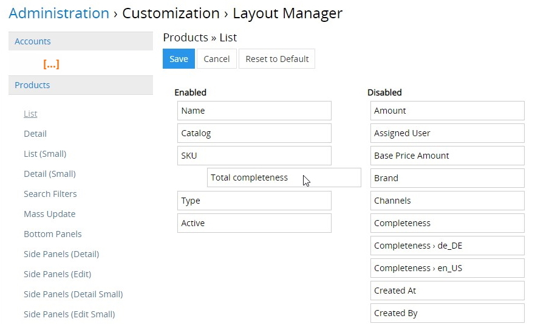

Click the `Save` button to complete the operation. The added `Completeness` field(s) will be displayed on the configured layout type for the given entity:

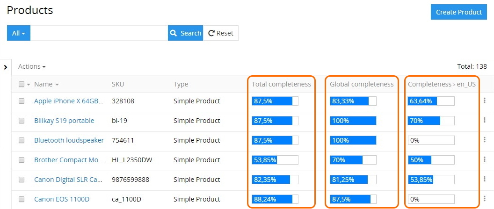

When the entity record with enabled completeness is edited (e.g. required fields are added, removed, etc.), the completeness percentage is recalculated on the fly.

#### Search Filters

In the same way, completeness levels can also be added to the search filters list in the Layout Manager: 

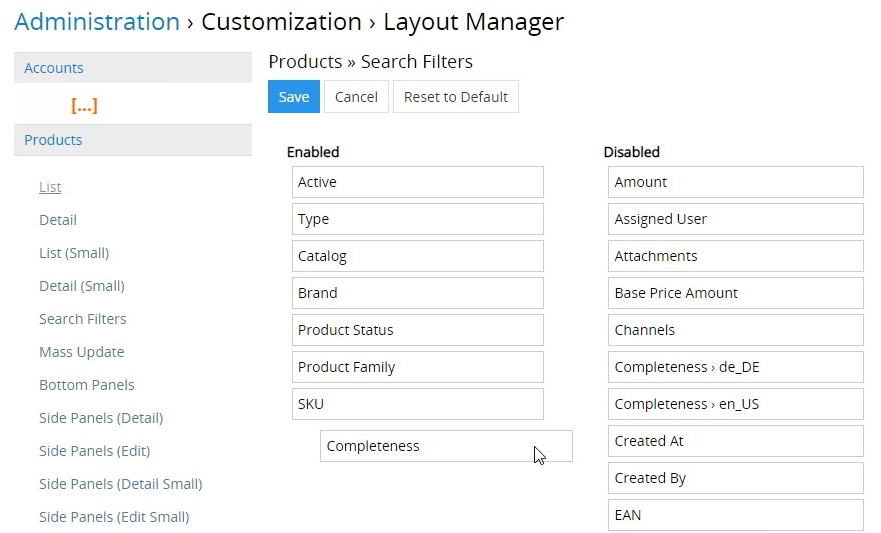

As a result, the enabled filters are added to the filter drop-down list of the configured entity:

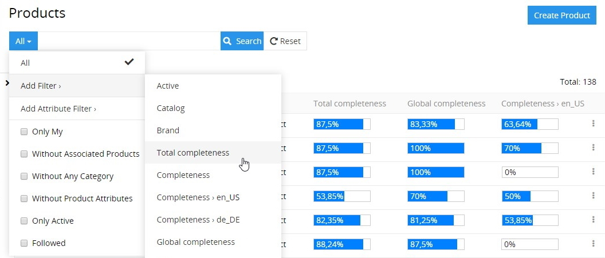

## Completeness Calculation Principles

Having the "Completeness" module installed and properly configured ensures the entity record data calculation in the following ways:

- **Total completeness** – the completeness level of the required fields, including their languages. For product records, the total completeness calculation also includes the required attributes and their languages;

- **Language completeness** – the completeness level of the required multilingual fields. For product records, the required multilingual `Global` attributes (of the `Boolean`, `Enum`, `Multi-Enum`, `Text`, `Varchar`, and `Wysiwyg` types with the activated `Multi-Language` checkbox) are also included to this calculation;

- **Completeness** – the completeness level of the required fields and required product attributes. The required multilingual fields are not included here, only the main field values.

Moreover, two additional completeness types are also calculated for [Product](../atropim/user-guide/products.md) records:

- **Global completeness** – the completeness level of the required fields, including their languages. For product records, the total global calculation also includes the required `Global` attributes and their languages.
  
- **`Channel` completeness** – the completeness level of the required fields and required `Channel` attributes. If the required `Channel` attribute values are not available, the completeness is calculated on the basis of the required fields only.

## User Functions 

After the "Completeness" module is installed and configured by the administrator, user can view the completeness levels of entity records that are predefined by the [administrator](#administrator-functions) and sort the records in this column accordingly:

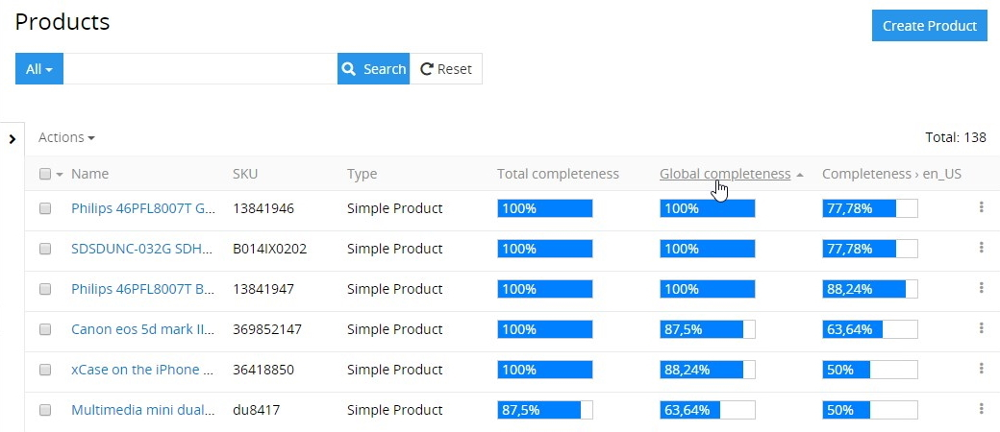

Also user can filter entity records by their completeness levels in accordance with [search filters](#search-filters), predefined by the administrator:

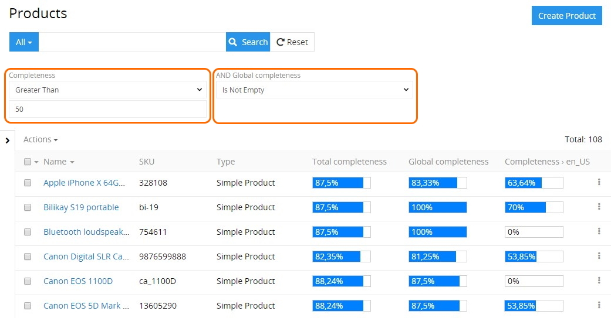

Moreover, user can influence the completeness statistics by editing the required fields and attributes of the configured entities according to his access rights.

### Completeness Dashlets

In order to conveniently track the completeness of product information in the system, user can display special [dashlets](../atropim/user-guide/dashboards-and-dashlets.md#dashlets) on his custom dashboard:

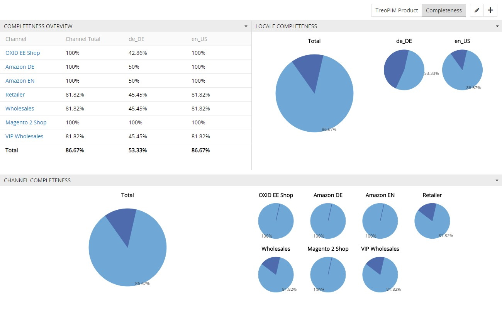

The following dashlets are available for display:

- **Completeness overview** – total completeness values, including configured languages and channels, in the table view. 
- **Language completeness** – completeness by languages separately and total, in the graphic form.
- **Channel completeness** – completeness by channels separately and total, in the graphic form.
