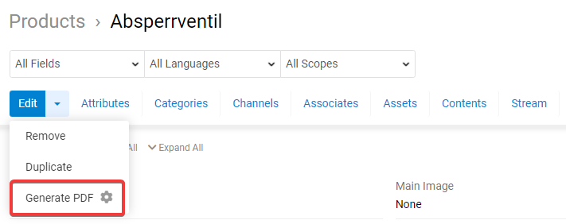
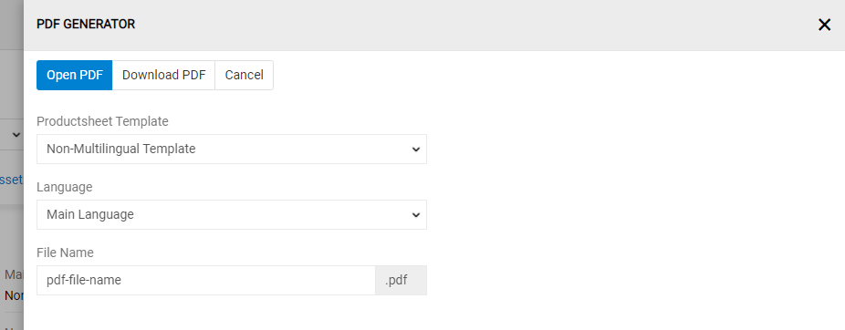
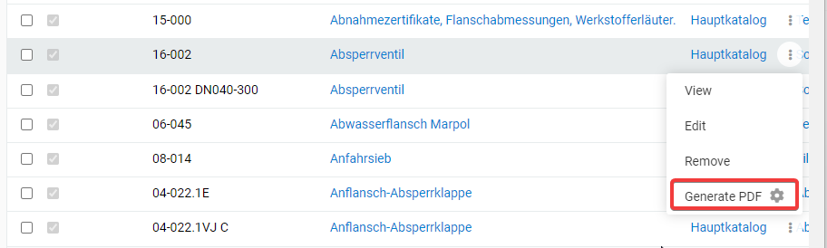
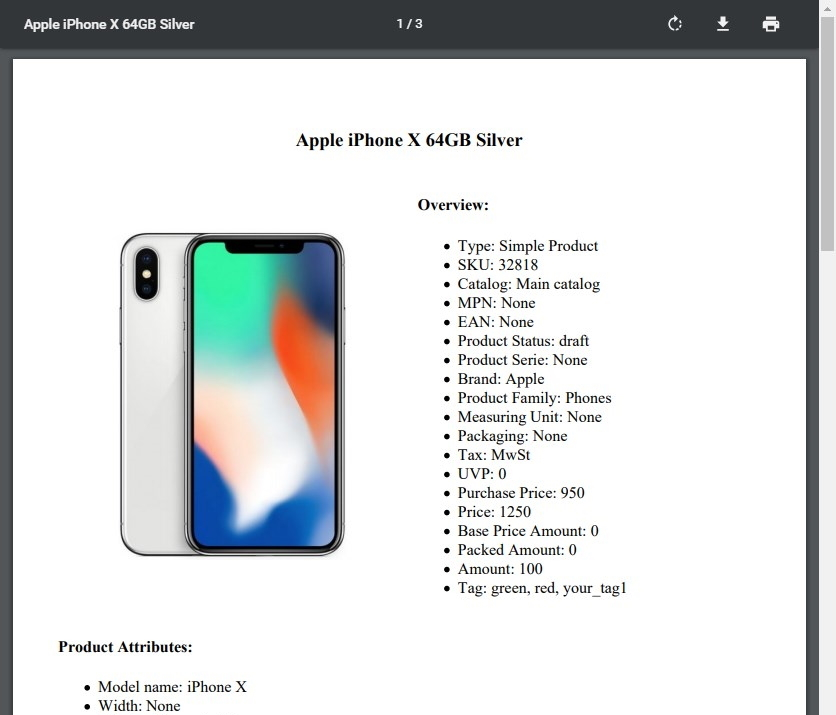
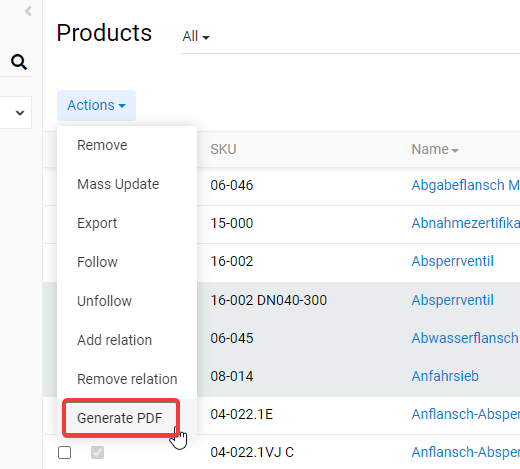
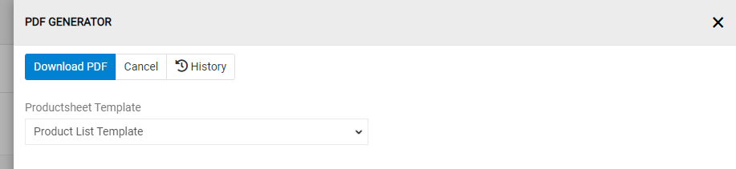

# PDF Generator

The "PDF Generator" module enables you to generate PDF files based on any data.

> Please note, templates for generation of PDF files are needed to be individually coded for this module to work. Usually these are coded directly by AtroCore Team or by our Solution Partner.

PDF document can be generated for:
- single item, eg some product
- list of items, eg list of products.

> Please note, templates are created based on HTML/CSS. So anything is possible, what is possible with a modern HTML/CSS technology.

## Administrator Functions

"PDF Generator" module has no administrator settings.

## User Functions 

### PDF Creating for Single Item (e.g. Product)

If a template for creating of PDF for a single item is available following option appears in the actions menu on the detail page of the respective entity:

Click on "Generate PDF" to open the new window, where you have additional configuration options:

Here you can select the template (if you have more than one), which is/are created for you, select the language for PDF file to be generated (if enabled in the template), select the channel (if enabled in the template), for which the PDF file is determined, and set the file name. You can open the pdf document in a new tab or download it directly with the fine name you have defined previously.

It is also possible to create PDF directly from list page. Open the actions menu for the respective record and choose "generate PDF" for that.

Generated PDF looks exactly as defined in your template:

### PDF Creating for Item List (e.g. Product List)

If a template for the generating of the PDF document for a list of items is created (e.g. product list for some offer etc.) you can select some items, than go actions and select "Generate PDF". 

In the new window you can select the template for PDF generation (if you have more than one) and download your PDF:

