# Pricing 

The "Pricing" module enables to operate with different prices for different customer groups and channels. In addition, you can take usage of scale pricing capabilities and automatic price conversion to different currencies. The module still enables you to set the price in each currency for any amount manually.

## Administrator Functions  

The "Pricing" module significantly extends the pricing functionality of the [AtroPIM](/atrocore/docs/blob/master/atropim/user-guide/what-is-atropim.md) PIM System.

After the module installation, a new entity `Price Profile` is added to the [navigation menu](https://atropim.com/help/user-interface#navigation-menu) and the `PRODUCT PRICES` panel is added to the [products](https://atropim.com/help/products) detail view page instead of the `Price` field.

### Currency Configuration

To configure the currencies used in pricing for product distribution, go to `Administration > Currency`:

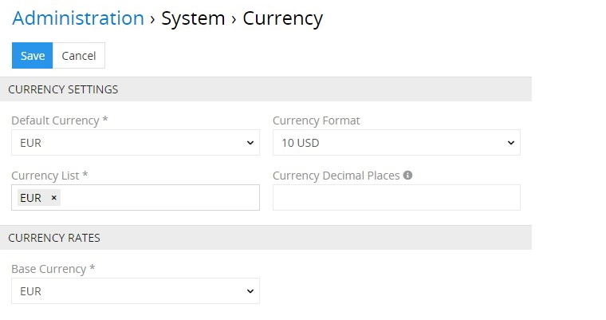

The `EUR` currency is set by default, but you can expand the list with as many currencies as needed. To do this, click the `Currency List` field and choose the desired options from the drop-down list that appears:

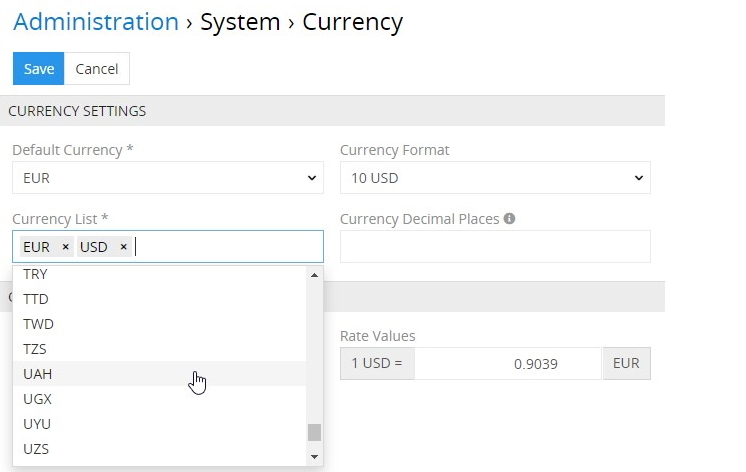

Here you can also select the default currency (to be used when creating new records) and currency format via the corresponding drop-down lists. In the `Currency Decimal Places` field, specify the number of decimal places to be used in currency fields and calculations or leave the field empty to have all filled decimal places displayed.

On the `CURRENCY RATES` panel, you should also specify the conversion rates for the currencies available in the currency list. For this, select the base currency and enter its rate value according to other currencies:

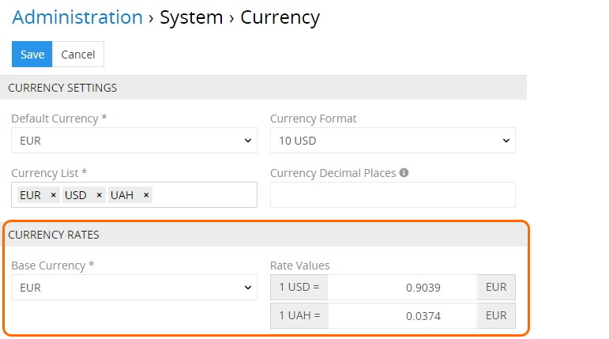

Click the `Save` button to apply your currency configuration or `Cancel` to abort the process.

### Access Rights

By default, the pricing feature is enabled for all users, however, it can be disabled for certain user roles, if needed, on the `Administration > Roles > 'Role name'` page:

Please, note that access rights for `Channels` and `Products` should also be enabled.

## User Functions

After the "Pricing" module is installed and configured by the administrator, user can work with price profiles in accordance with his role rights that are predefined by the administrator.

## Price Profile

A price profile is a configurable price variation that allows you to define various prices for different groups of customers, both in numbers and currencies. Examples of price profiles may be the following: Regular prices, Wholesale, VIP clients prices, Seasonal discounts, etc.

### Creating

To create a new price profile record, click `Price Profiles` in the navigation menu to get to the profiles [list view](https://atropim.com/help/views-and-panels#list-view), and then click the `Create Price Profile` button. The common creation window will open:

Here enter the desired name for the price profile record being created and define the currencies to be used in it (in accordance with the ones defined on the [currency configuration](#currency-configuration) step). 

Please, note that the default currency cannot be removed.

Activate the price profile and enter its description, if needed.

Please, note that only activated profiles are added to the products available in the system.

Click the `Save` button to finish the price profile creation and move to its [configuration](#configuring) or `Cancel` to abort the process.

### Configuring

The price profile [detail view](https://atropim.com/help/views-and-panels#detail-view) page opens when the price profile is saved:

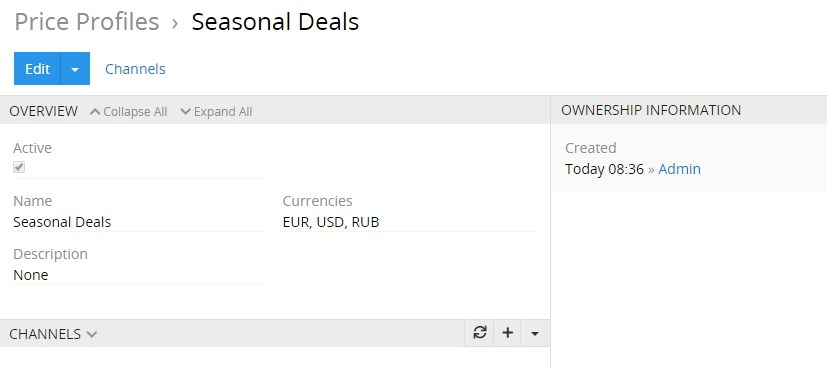

Here, on the `CHANNELS` panel, relations between [channels](https://atropim.com/help/channels), through which product distribution is performed, and price profiles are established and managed via selecting the existing ones or creating new channels:

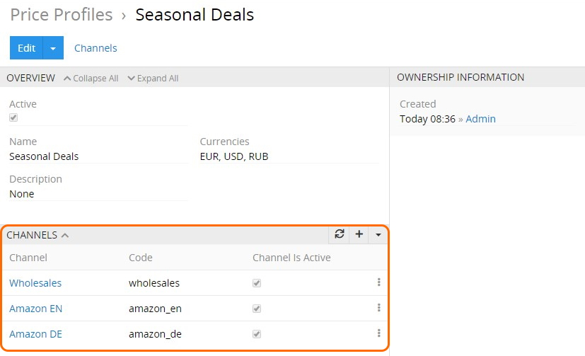

Read more about these options in the corresponding [article](https://atropim.com/help/products#channels) of the AtroPIM user guide. 

Alternatively, you can link price profiles with channels on the `PRICE PROFILES` panel within the desired channel detail view page:

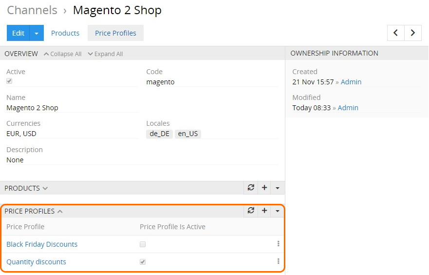

## Product Price Setup

As soon as the active price profile is created, it is added to all products available in the system and is displayed on the `PRODUCT PRICES` panel:

Here you can define product prices for all currencies pre-configured for the given price profile. To do this, select the `Edit` option from the actions menu of the desired price profile:

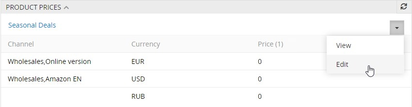

In the editing pop-up that appears, enter the product price in the default currency – the price for other currencies will automatically be calculated according to the defined currency rate values:

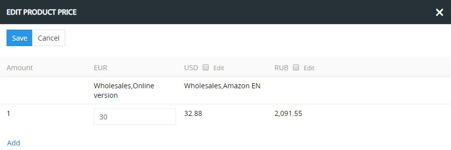

However, you can modify the automatically calculated price via selecting the `Edit` checkbox for the desired currency and entering a different value:

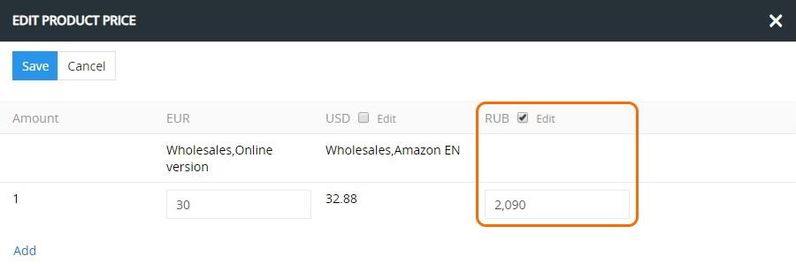

> Please, note that if you remove the selection of the `Edit` checkbox, the automatically calculated value will be recovered. Selecting the `Edit` checkbox once again will not lead to restoring the previously entered value.
  
If you need to scale the product price, i.e. differentiate it according to the amount of items sold, click `Add` and enter the desired price values in the added fields:

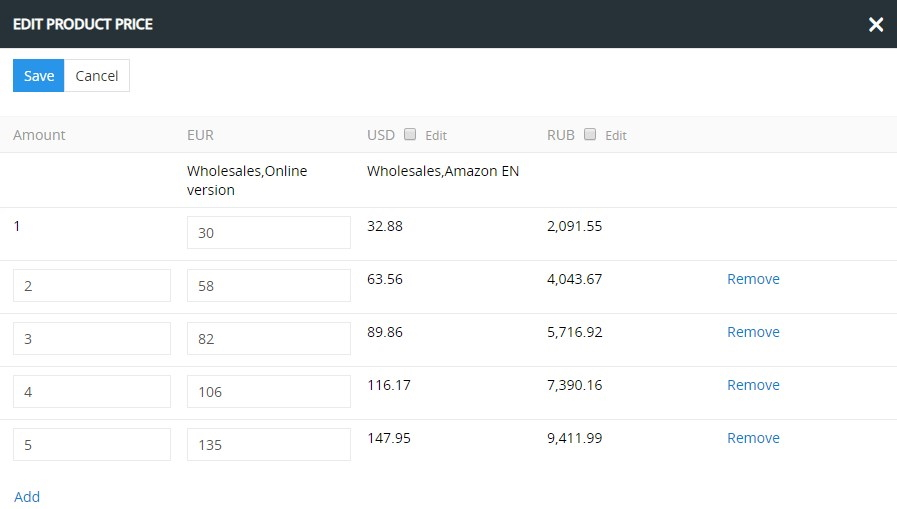

Click `Remove` to delete a whole row of price values for all currencies, if needed.

To apply the changes, click the `Save` button – the defined product price values will be displayed on the `PRODUCT PRICES` panel:

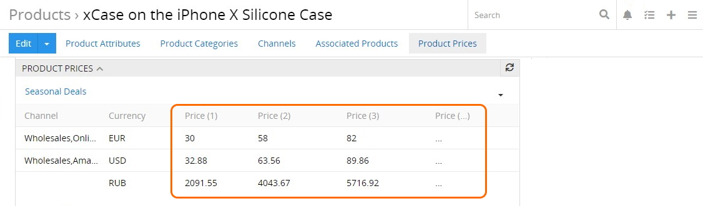

Please, note that only first three prices are shown on the panel. To see them all, open a separate pop-up via the `View` option from the actions menu of the given price profile:

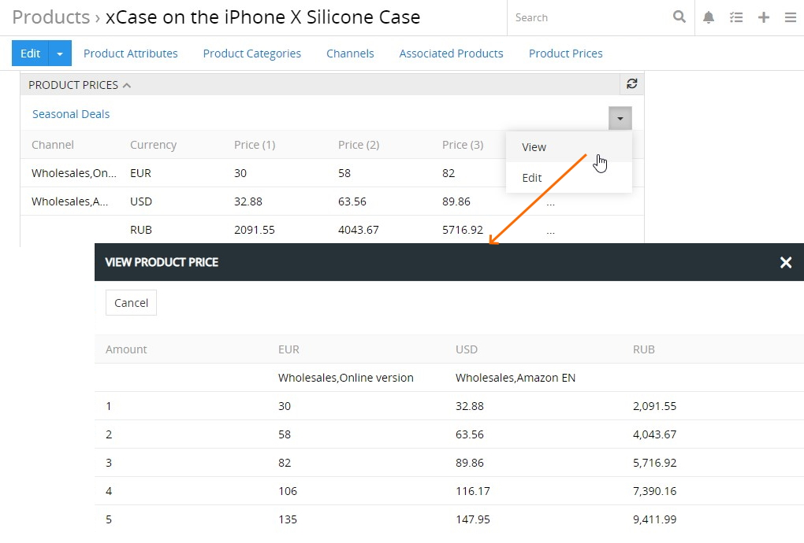

If you need to [duplicate](https://atropim.com/help/products#duplicating) the product record, in which the price values are configured, you can choose whether the prices are to be duplicated as well in the confirmation pop-up that appears:

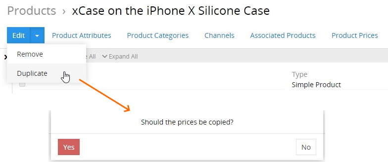
 
## Channels and Product Prices

The `PRODUCT PRICES` panel display depends on the currency settings of the channels linked to the product record, namely price details for active channels only are given according to price profiles, sorted by currencies:

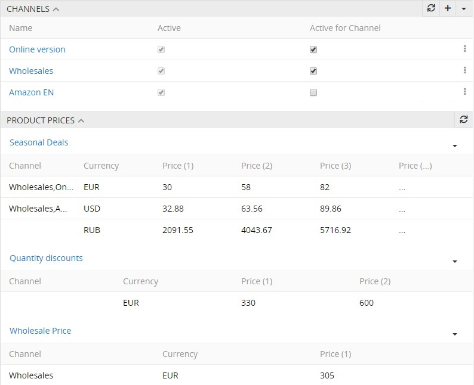

## Module Advanced Features

Additionally, the "Pricing" module can be efficiently used with the ["Product Variants"](https://atropim.com/store/product-variants) module to differentiate prices for configurable products and their variants. Visit our [store](https://atropim.com/store) to learn more about the "Product Variants" module and other add-ons available for you.

## Purchase Conditions
The price does not include VAT. For the price stated above you will get the module including updates and upgrades for one year. After that, you may still use your last version of the module, or purchase the module again with a 50% discount, which gives you a right to updates and upgrades for an additional year. Furthermore, our [EULA](https://atropim.com/eula) (End-User License Agreement) will apply.

## Customization
The module can be adapted to your needs, additional functions can be programmed, existing functions can be changed. Please contact us regarding this. Our [GTC](https://atropim.com/gtc) (General Terms and Conditions) apply.

## Demo
Please contact us, and we will send you the access data for the demo version.
