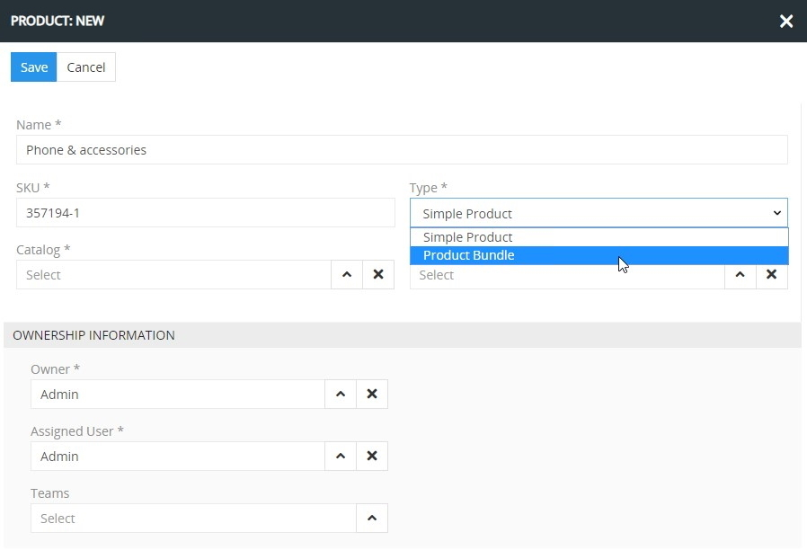
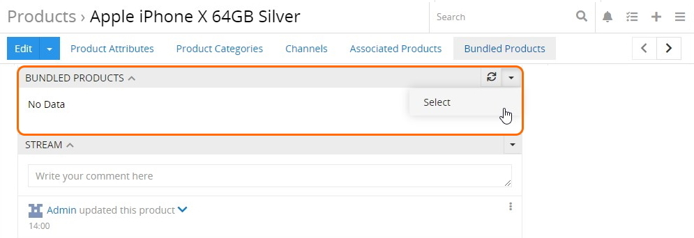
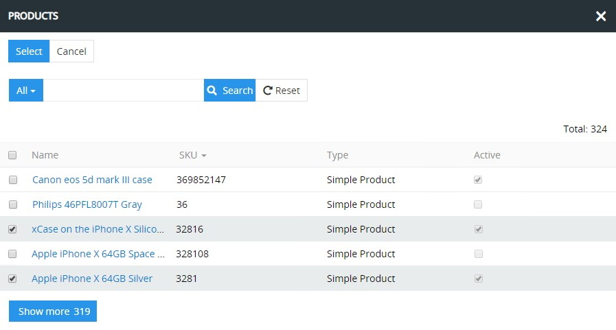
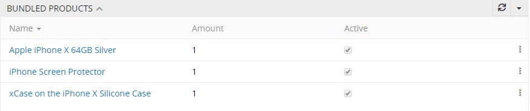
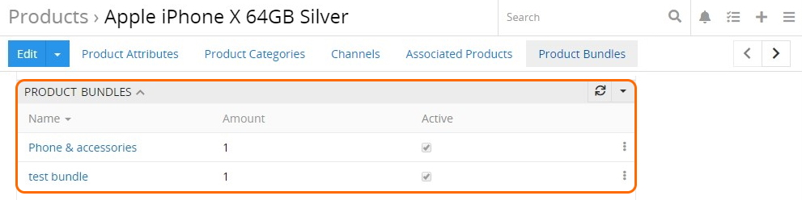
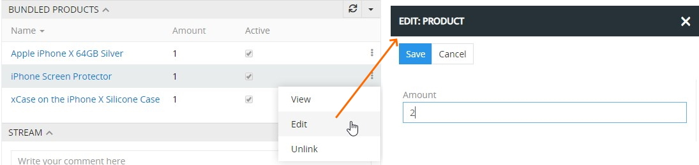
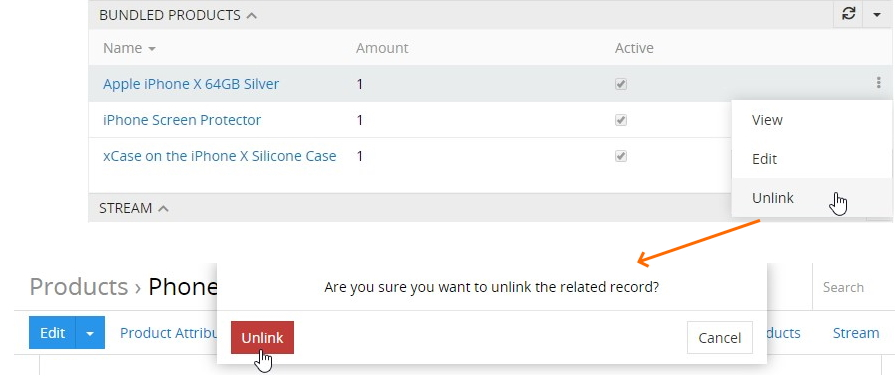
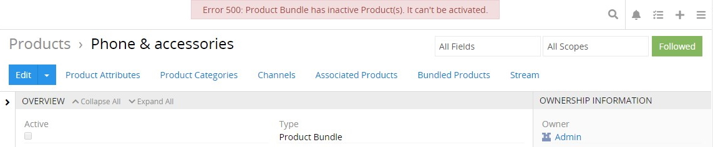

# Product Bundles

The "Product Bundles" module allows you to create combined products of the "Product Bundle" type, which consist of several other products and, thus, are sold togather to boost sales. 

Product bundle is a fully-fledged product, that has the same properties as any simple product. It may have own product attributes, prices, assets, relations etc. You can define an amount for each included bundled product.

## Product Bundle Creation and Editing

Once the module is installed, a `Product Bundle` option is added to the list of product types. To create a product record of this type, click the `Create Products` button on the product records [list/plate view](https://atropim.com/help/products#listing) or use the [quick create](https://atropim.com/help/user-interface#quick-create) button. The creation pop-up will appear:

Enter the product bundle record information and click the `Save` button to be redirected to the its editing page. Make changes, if needed, and click `Save` to complete the product bundle creation.

## Linking Products to a Bundle

Product records of the `Simple` type can be linked to a product bundle on the `BUNDLED PRODUCTS` panel within the product bundle [detail view](https://atropim.com/help/products) page. To do this, use the `Select` actions menu option:

In the pop-up that appears, select the desired products to include in the bundle:

The selected bundled products will be displayed on the corresponding panel:

Also notice that the list of product bundles to which the given bundled product is linked, is displayed on the `PRODUCT BUNDLES` panel within the product record detail view page:

If you have the ["Product Variants"](https://atropim.com/store/product-variants) module installed in your system, you can also link the `Product Variant` records to the product bundles.

## Operations With Bundled Products

The following details of the bundled product records are given on the corresponding panel:

- **Amount** – the number of given product items included in the bundle. The default value is `1`, but it can be modified, as described below.
- **Active** – the activity state of the product record.

Bundled product record data can be viewed in a quick detail view pop-up using the corresponding option from the single record actions menu:

To change the amount of bundled product items to be delivered in the current product bundle, use the `Edit` option from the single record actions menu and modify the `Amount` field value in the pop-up that opens:

Please, note that activating/deactivating of the bundled product record cannot be done in the editing pop-up. For this you have to open the record [detail view](https://atropim.com/help/views-and-panels#detail-view) page by clicking the desired bundled product record name. 

Unlinking of the bundled products from the product bundles is performed via the `Unlink` option from the single record actions menu of the desired bundled product record on the `PRODUCT BUNDLES` panel and confirming the decision in the pop-up that appears:

## Activity Interdependence for Product and Product Bundle Records

Generally, active product bundle records have only active product records. Linking at least one non-active record to a product bundle leads to deactivation of the given bundle record. If you try to activate this bundle record again, the following error message appears:

Prior to activating the product bundle record again, you have to activate all its [bundled products](#operations-with-bundled-products) or unlink non-active product records from it. 

When a bundled product record is deactivated during its editing, all product bundles, to which it is linked, also become non-active. 

Please, mind these activity interdependence rules when editing product and product bundle records.
