# Product Variants

The "Product Variants" module enables to create and work with product variants. A product variant is a fully-fledged product with own attributes, assets, prices, relations etc. 

This module adds the possibility to work with product of two types – configurable product and product variant. A configurable product is a product, which can have product variants. One configurable product may have multiple product variants assigned to it. A product variant can be assigned only to one configurable product.

The product variants can be set with or without variant-creating attributes If the product variants are created using the variant-creating (configurable) attributes, the system automatically checks that these values are uniform for each product variant. Product variants created in this way are called **multi-dimensional variants**. Product variants can inherit the fields values and the attribute values from configurable products.

This module is generally the extension of the product entity functionality. To learn more about products and their features, refer to the corresponding [article](https://atropim.com/help/products) of the AtroPIM user guide.

## Product Variant Creation and Configuration

**A product variant** is basically a salable product with a full set of properties. Product variants can only be created for products of the "configurable product" type and are displayed in a separate panel.

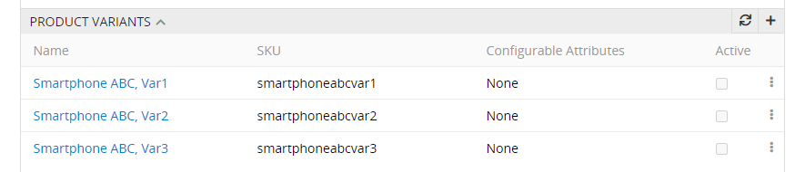

> Please, note that creating a variant without linking it to the configurable product is not possible.

**To add a product variant**, create a new configurable product or open the desired [configurable product](https://atropim.com/help/products) in the product list and click on `+` in the" Product variants ";

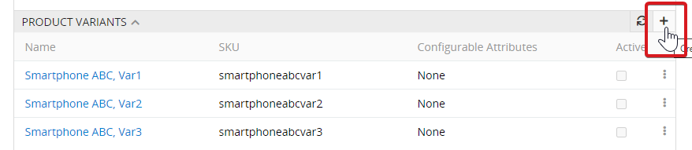

a product creation pop-up will appear:

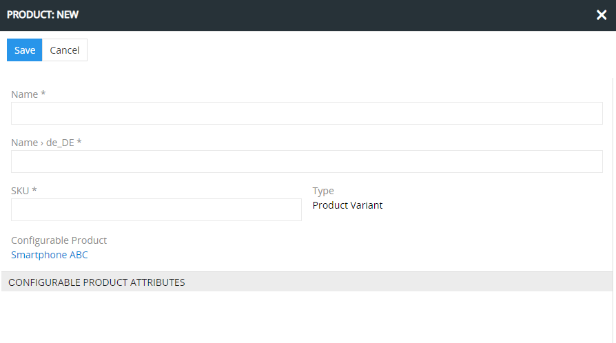

The configurable product is already specified.

On the product list page, the product variants are displayed under all other products. You can create the product variant directly on this page, for this you should click on the `Create` button and fill in the information in the pop-up window.

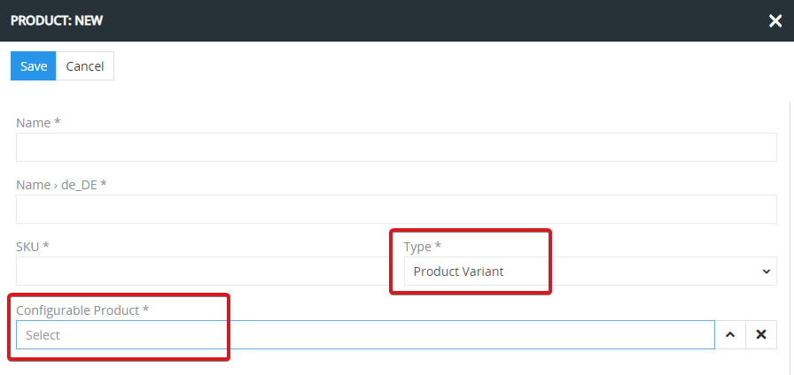

You can use the variant-creating (configurable) attributes to create the product variants - only the attributes of type Bool, Enum, Varchar, Int, Float, Unit, Image can be selected. Configurable attribute can be specified for the configurable product.

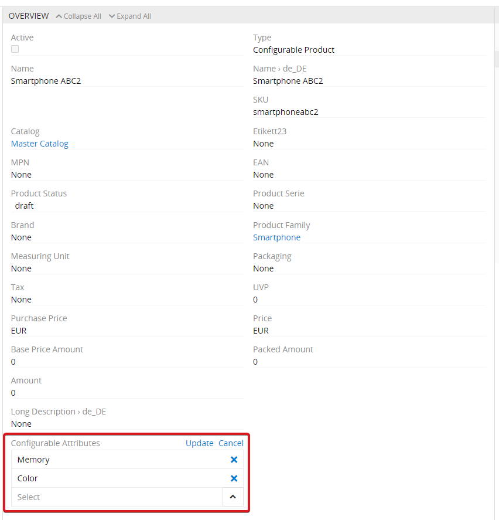

The composition of the values of these attributes should be uniform for a product variant. E.g. If the attributes "Color" and "Memory" are defined as configurable attributes, you can only have one product variant with the color "black" and memory "32 GB" in the system. Configurable attributes can be specified for a configurable product at any time, both before the creation of the product variants and afterwards.

If the configurable attributes are set after the product variants have been created, the system will check whether the selected combination of these attributes leads to the formation of uniform product variants. If this is not possible with product variants that have already been created, the user is shown a corresponding error message.

Configurable attributes can be edited at any time for the configurable product. It is always automatically ensured that the existing product variants are uniform.

If the configurable attributes are defined in the system, the attribute values for these are automatically queried when a product variant is created.

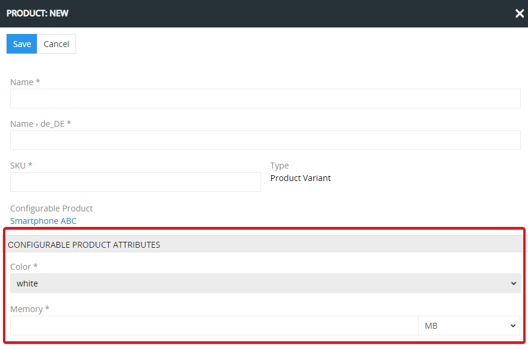

These are then also displayed in the panel for product variants for the configurable product.

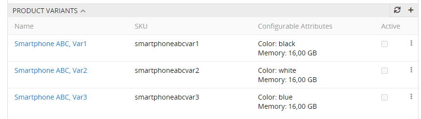

The values for configurable attributes can be edited in the normal way for the product variants, just like for the other attributes. The system will automatically check that the existing product variants remain unique. The names of the configurable attributes are underlined for a product variant.

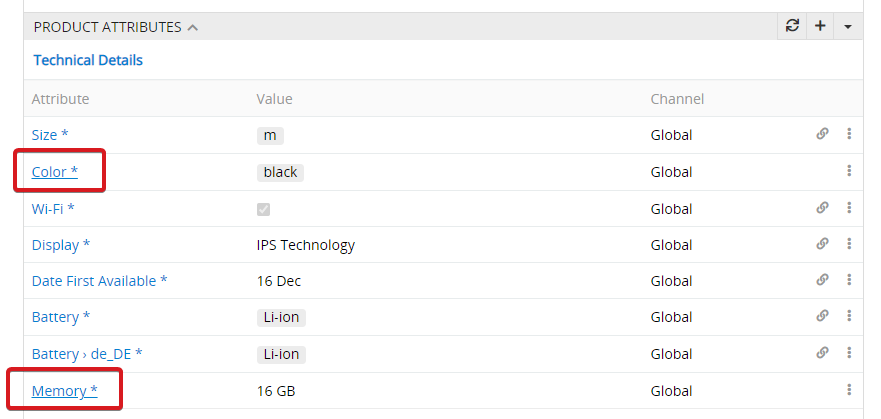

The product variant can also have its own **user-defined attributes** that have not been inherited from the parent.

It is possible to switch from the side of one product variant to the side of another product variant. For this you should use the menu in the breadcrumbs navigation.

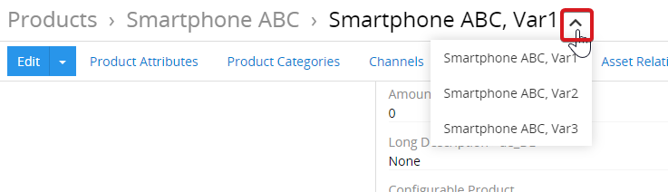

From here you can also switch to the configurable product page.

## Product Variant Editing

Unlike configurable products, the variants have locks on panels, data fields and product attribute values, since their values are inherited from the configurable products. If the lock is active, the values are inherited from the configurable product. To activate editing, click the lock button on the desired panel, data field or attribute value.

### Panels

When the panel is unlocked for editing, you can perform any action available in the AtroPIM system for this particular entity panel (add, select, refresh, etc.), as well as perform single record actions for the entity records present on this panel:

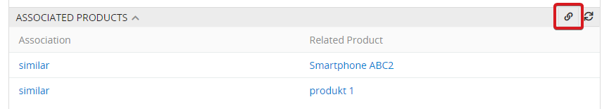

> Beware that if you lock the panel back, its content will return to the values inherited from the parent configurable product, and all your changes, i.e. product variant's own relations, will be discarded. Unlocking the panel once more will not lead to the display of the previously configured values. 

Please note that the inheritance of the values for categories and channels is always switched on or off together. The reason for this is that the linked channels for a product are always determined via the categories, because channels are linked with category trees.

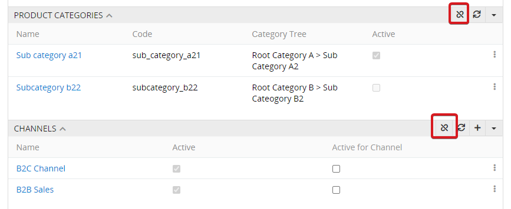

### Fields

It is possible to set an individual value for each field of a product variant. For this, the inheritance of the value should be switched off. After you have unlocked the desired product variant field, click on the pencil button to edit the value:

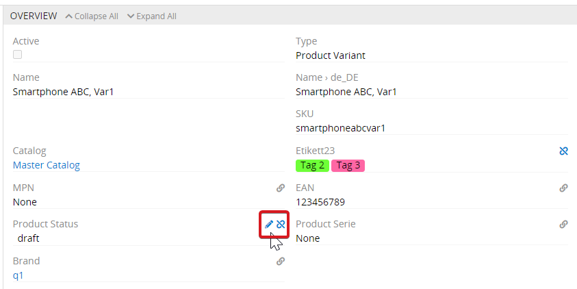

Update the unlocked field's data and click `Update` to commit your changes.

To return to the parent configurable product value for the desired panel/field, click the released lock button. The performed changes are automatically saved and displayed – no need to refresh the page.

### Attribute values

The inheritance of the attribute values can be switched on or off, just like the inheritance of the product fields. To do this, click the lock button. The attribute value can then be set individually.

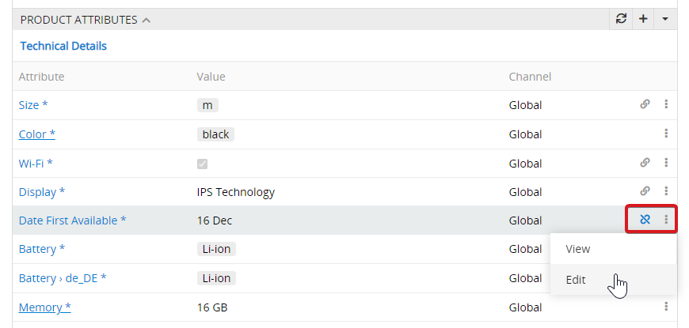

