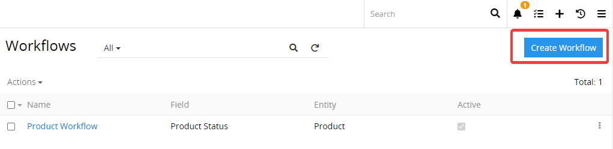
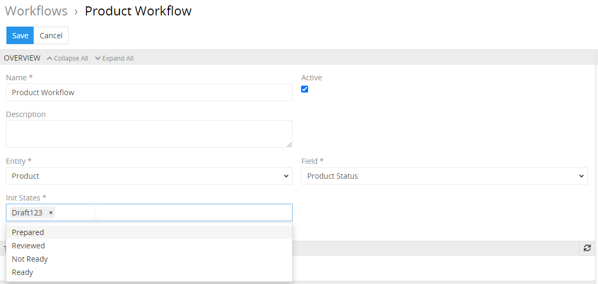

# Workflows

The workflows module enables you to implement and manage different processes and actions, triggered by certain events in the system and taking account of certain conditions. The main purpose of workflow configuration and programming is to automate processes and create/modify data records, to save time, minimize human error, and improve collaboration. Absolutely any workflow can be implemented.

The module enables you to define certain states (e.g. product status) for a workflow and transitions under certain conditions (e.g. the reviewer has approved the product data), which results in changing from one state to another (e.g. product status is changed to "approved"). Such changes can also be supplemented with certain actions (e.g. product is automatically activated and can be published on different channels).

Currently only transitions can be configured, everything else should implemented by programmers. Implementation of a simple workflow can take appx. 1-2 hours into account.

This module is based on the [Symfony Workflow Component](https://symfony.com/doc/current/components/workflow.html) aextending it with own specific features. So you can use this Component without any limitations. You can also use the [Symfony EventDispatcher Component](https://symfony.com/doc/current/components/event_dispatcher.html), which comes  with AtroCore out of the box, because the event handing in AtroCore is based on it.

## Concepts

A workflow is a model of a process in your application. It may be how the product description process goes from "draft" to "review" and "publish". 
A workflow is a process or a lifecycle that your objects go through. Each step or stage in the process is called a `place`. You also define `transitions` that describe the action of getting from one place to another.

### State Machines

A state machine is a subset of a workflow and its purpose is to hold the state of your model. The differences are:
Workflows can be in more than one place at the same time, whereas state machines can’t.
In order to apply a transition, workflows require that the object is in all the previous places of the transition, whereas state machines only require that the object is in at least one of those places.
For examples please refer to the official Symfony Documentation.

### Definition of a Workflow

The definition of a workflow consists of `places` and `transitions` to get from one place to another. The `GuardEvent` is used to decide the next steps to allow or disallow for a specific transition.

### Using Events

To make your workflows more flexible, you can construct the Workflow object with an `EventDispatcher`. You can now create event listeners to block transitions (i.e. depending on the data in the product description) and do additional actions when a workflow operation takes place (e.g. sending announcements).
Please see the official Symfony Documentation for more information about events.

## Creating a Workflow

You can configure as many workflows as you wish. More than one workflow can be appended to an entity.

Click on the button `Create Workflow` to create a new workflow.

To create a new workflow define the "name", then choose the "entity" to allign with the workflow and the "field", which stores the possible places of the workflow. You can also define the "init states" here. More than one is allowed. You can also write a brief description about your workflow, so that you don't forget how it works in the future.

### Transitions
In the panel Transitions you can define all possible transitions for your workflow. Click on the plus icon to define a new transition.

Choose the “from” state and the “to” state, activate the transition and click on the `Save` button to save the new transition.

The frontend automatically supports, that only configured transitions are available. So if you set the system up so that when choose from “Draft” the workflow can only change to “Prepared”. This is the only option that will be available in the dropdown menu for the state.

The system will automatically create the workflow chart, so you can see what your workflow looks like visually.

## Advanced Workflows
Any advanced workflows and business process modeling can be implemented by workflow programming. Please refer to the Symfony Documentation to get to know the process.

